# Agentic Execution Platform — Architecture Overview

## 1. Purpose of this document

A starting point for technical readers seeing the platform for the first time. It describes what we're building, what we're adding to the existing Kubernetes baseline, how the pieces fit together, what work is installation versus what work is custom development, what documentation and tests need to exist alongside the code, and how the work breaks into components.

## 2. Goals

The platform exists to:

- Run AI agents as governed, observable, policy-controlled Kubernetes workloads.
- Funnel every LLM call, MCP call, A2A call, and outbound HTTP through a single chokepoint for routing, audit, cost control, and policy.
- Support multiple agent SDKs and trigger styles — interactive, scheduled, event-driven, and long-running.
- Be GitOps-driven end to end: skills, prompts, agent specs, capability registries, policies, and infrastructure compositions all reconcile from Git.
- Sandbox agents securely with controlled outbound network, controlled MCP and tool access, per-agent skill scoping.
- Provide rigorous evaluation, A/B testing, trace replay, and a self-retrospection loop that proposes improvements.
- Treat platform self-management as a first-class concern: a diagnostic agent (HolmesGPT) lives on the platform from day one and grows with it.

The target scale for v1.0 is well below 5,000 LLM requests per second. LiteLLM has known Python-related overhead at that scale; if we ever approach it, the gateway becomes a re-evaluation point (Bifrost is the Go alternative). v1.0 explicitly does not optimize for that case.

## 3. Baseline assumptions

The cluster has these pieces already running. The platform is built on top of them; we don't replace any of them.

| Component | Role | How the platform uses it |
|---|---|---|
| ArgoCD | GitOps reconciliation | Reconciles every platform manifest, CRD, OPA bundle, Crossplane composition, Headlamp plugin manifest, and skill artifact from Git. |
| Grafana + Loki + Prometheus | Observability backend | Metrics and logs base. We add Tempo and Mimir on top (see section 5). |
| Keycloak | IdP broker fronting AD / Okta / etc. | SSO for every UI and admin API. |
| Crossplane v2 | Declarative cloud resource provisioning | Compositions for cloud-shaped resources (`AgentEnvironment`, `MemoryStore`, etc.). |
| External Secrets Operator | Secret sync from cloud secret stores | Pulls credentials into Kubernetes Secrets for the platform to consume. |
| cert-manager | TLS certificate lifecycle | Issues and rotates certs for ingress, mTLS, internal services. |
| Git server | Source of truth | Holds all platform manifests, skill artifacts, OPA bundles, capability CRs, agent specs. |
| Container registry | Image storage | Holds platform images, agent base images, custom controller images. |
| Ingress controller | L7 ingress | Serves external traffic to platform UIs and the LiteLLM gateway. |
| ExternalDNS | DNS record management | Maintains DNS records for cluster ingress hostnames. |
| Cloud or in-cluster load balancer | L4 fronting the ingress controller | Cloud-managed on EKS / AKS, MetalLB or equivalent in kind. |
| Cluster OIDC issuer | Service-account token federation | Required for AWS IRSA, Azure Workload Identity, and federating Kubernetes service-account identity to Keycloak. See section 6.11. |
| CSI storage driver | Persistent volume provisioning | Whatever the cloud provider's default offers; consumed by Postgres, OpenSearch, NATS JetStream, and the PV-access subsystem (B20). |

Detailed baseline configuration — exact ingress controller, CSI driver versions, DNS strategy — is documented in the **`k8-platform` companion repository**. This architecture assumes a conformant install of that baseline; deviations from it are a baseline-repo concern, not an architecture-of-this-platform concern.

The cluster itself runs on EKS, AKS, or kind for development. **We do not depend on a specific CNI** — egress controls happen at an Envoy-based egress proxy rather than via CNI L7 policy. **Each cluster is an independent install of the platform.** Multi-cluster federation is not a v1.0 requirement; the EKS / AKS / kind list describes where the platform can run, not a topology that knits clusters together. **Initial v1.0 implementation targets AWS (EKS) and GitHub for source control and CI**; Azure (AKS) is supported by the architecture but not exercised in v1.0.

## 4. High-level architecture

```mermaid
flowchart LR
  subgraph U[Users]
    direction TB
    EU[End users]
    DEV[Developers]
    ADM[Admins]
  end

  subgraph IF[Interfaces]
    direction TB
    LC[LibreChat - locked-down<br/>frontend only]
    HL[Headlamp + custom plugins]
    LFUI[Langfuse UI]
    OSUI[OpenSearch Dashboards]
    AWUI[Argo Workflows UI]
    ACUI[ArgoCD UI]
  end

  subgraph CTRL[Control + Gateway]
    direction TB
    LL[LiteLLM Gateway<br/>LLM + MCP + A2A + virtual keys<br/>OpenAI-compat ↔ A2A]
    EP[Envoy egress proxy<br/>FQDN + audit + OPA]
    ARK[ARK agent operator]
    SB[agent-sandbox controller]
    KE[Knative Eventing<br/>+ NATS JetStream broker]
    AW[Argo Workflows]
    LLOP[Custom kopf operator<br/>for LiteLLM]
  end

  subgraph WORK[Workloads + Data]
    direction TB
    AG[Agent pods<br/>in Sandboxes]
    HOLMES[HolmesGPT<br/>platform self-mgmt agent]
    MEM[Memory backend<br/>Letta]
    OS[(OpenSearch<br/>vectors · RAG · audit search<br/>retrieval optimization)]
    PG[(Postgres<br/>state · checkpoints<br/>LibreChat DB)]
    OBJ[(Object storage<br/>immutable archive · artifacts)]
    EXT[LLM providers<br/>+ MCP servers<br/>+ A2A peers]
  end

  subgraph PL[Platform services]
    direction TB
    AC[ArgoCD - baseline]
    GR[Grafana + Loki + Prometheus<br/>baseline]
    TM[Tempo + Mimir - new]
    KC[Keycloak - baseline]
    XP[Crossplane v2 - baseline]
    ESO[ESO - baseline]
    CM[cert-manager - baseline]
    GIT[(Git - baseline)]
    REG[(Registry - baseline)]
    LF[Langfuse - new]
    OPA[OPA / Gatekeeper - new]
    REL[Reloader - new]
    O2P[oauth2-proxy - new]
  end

  U --> IF
  IF --> CTRL
  CTRL --> WORK
  PL --> CTRL
  PL --> WORK
  WORK -.->|telemetry| PL
```

The platform is organized into five planes:

**Interfaces** are how humans interact with the platform: LibreChat (locked-down frontend) for end users, Headlamp for admins and developers, plus Langfuse / OpenSearch Dashboards / Argo Workflows / ArgoCD UIs for specialized operations. Everything is SSO'd via Keycloak.

**Control + Gateway** is the choke layer. LiteLLM brokers every LLM, MCP, and A2A call (and translates between OpenAI-compatible HTTP and A2A so frontends like LibreChat see agents as models). Envoy egress proxy handles all other agent outbound HTTP. ARK manages agent lifecycle declaratively. agent-sandbox provides isolation primitives. Knative Eventing on NATS JetStream is the event mesh; Argo Workflows handles orchestration.

**Workloads + Data** is where agents run. Agent pods live in Sandboxes. **HolmesGPT runs here as a Platform Agent from day one** — same constraints as any agent (LiteLLM, OPA, sandbox), with broad read access for diagnostics. Postgres is primary storage for state, checkpoints, and the LibreChat DB. OpenSearch is for retrieval optimization (vector + hybrid search, audit search, RAG indexes) — not primary storage; everything in OpenSearch is reproducible from somewhere else. Object storage holds immutable archives and large artifacts.

**Platform services** are cross-cutting capabilities. Most are baseline (ArgoCD, Grafana stack, Keycloak, Crossplane v2, ESO, cert-manager, Git, registry). New additions: Tempo and Mimir (extending the Grafana stack), Langfuse, OPA/Gatekeeper, Reloader, oauth2-proxy.

**Telemetry** flows from everything back through OTel into Tempo, Loki, Mimir; LLM-flavored traces also go to Langfuse and correlate with Tempo by trace_id.

## 5. Software added to baseline

Each component is classified by **activity type**: install, configuration, or custom development. Configuration means declarative settings (YAML, Helm values). Custom development means we are writing code that didn't exist before — even when it's a "plugin" or a "composition function." Python is the default implementation language for custom things.

| Component | Role | Activity type |
|---|---|---|
| **LiteLLM Proxy** | Unified gateway: LLM, MCP, A2A, virtual keys, OpenAI-compat ↔ A2A translation, callbacks. | Install (Helm) + configuration (YAML for static parts: default models, callback registrations, fallbacks) + **custom Python callbacks** for PII scrubbing, audit, guardrails. |
| **Custom kopf operator for LiteLLM** | Reconciles `MCPServer`, `A2APeer`, `VirtualKey`, `CapabilitySet`, `RAGStore` CRDs to LiteLLM's admin API. Python. | **Custom development (Python + kopf).** Functionally equivalent to a Crossplane provider; sits alongside Crossplane Compositions for cloud resources. |
| **Argo Workflows** | Workflow orchestration for triggered, scheduled, long-running agents, and approval flows. | Install (Helm) + workflow templates (config-heavy YAML). |
| **Knative Eventing** | Event sources, brokers, triggers (CloudEvents-native). | Install (Helm) + EventSource and Trigger configs. See section 6.7. |
| **NATS JetStream** | Broker backend for Knative Eventing. Same in dev and prod. | Install (Helm) + stream configuration. |
| **ARK** | Agent CRDs and operator: `Model`, `Agent`, `Team`, `Tool`, `Memory`, `Evaluation`, `Query`. | Install (Helm) + Agent CRD authoring (configuration). |
| **agent-sandbox** (kubernetes-sigs) | Sandbox CRDs for gVisor / Kata isolation, warm pools, hibernation. | Install + SandboxTemplate authoring (configuration). |
| **Envoy egress proxy** | All non-LiteLLM agent egress: FQDN allowlist, mTLS, audit, OPA hook. Replaces dependence on CNI L7 policy. | Install (Helm) + per-agent-class config (configuration). |
| **OPA / Gatekeeper** | Admission and runtime policy. | Install + **Rego policy bundle authoring (custom development — Rego is code)**. |
| **Tempo** | Distributed tracing backend. Extends the Grafana stack. | Install (Helm) + retention configuration. |
| **Mimir** | Long-term metrics storage; Prometheus-compatible. Extends the Grafana stack. | Install (Helm) + retention configuration. |
| **Langfuse** | LLM-grade observability, prompt management with A/B labels, datasets, experiments, evaluators. Always-on for every agent run. | Install (Helm) + configuration. |
| **promptfoo** | Adversarial evaluation and red-teaming in CI. | Container image consumed in CI + **eval suites (custom development — YAML and Python)**. |
| **LibreChat** | End-user chat UI. **Locked down to frontend-only**: native agent feature, plugins, MCP, file upload all disabled. Users see only the endpoint picker (Platform Agents via LiteLLM) and chat history. | Install (Helm) + configuration (lockdown plus Keycloak SSO). |
| **Headlamp** | Kubernetes admin/dev UI; primary entry point for platform navigation. | Install (Helm) + **custom plugins (custom development — TypeScript/React)**. |
| **OpenSearch** | Vector + hybrid search, RAG indexes, audit search, knowledge base index. Storage role only. OIDC against Keycloak in OSS. | Install (or managed OpenSearch) + index templates and ingest pipelines (configuration). |
| **Letta (memory backend)** | Agent memory service consumed via ARK's `Memory` CRD. Fully OSS. | Install + memory adapter (custom development for the adapter only). |
| **OpenAPI→MCP converter** | Generates synthetic MCP servers from OpenAPI specs, registered behind LiteLLM. | Install + per-server OpenAPI specs and auth configs (configuration-heavy). |
| **HolmesGPT** | Platform self-management agent: diagnostics, root cause, suggested remediations. Runs as a Platform Agent (Agent CRD), not an external system. OPA-gated. | Install (Helm) + per-component toolset contributions (configuration that grows with the platform). Plus **custom Python toolsets** for our specific components. |
| **`oauth2-proxy`** | Authenticating reverse proxy for tools whose OSS versions lack SSO (LiteLLM admin UI, etc.). | Install (Helm, multiple instances) + per-tool config against Keycloak. |
| **Reloader (stakater/reloader)** | Triggers rolling restart of dependent workloads when ConfigMaps or Secrets they consume change. | Install (Helm). |
| **Crossplane v2 Compositions** | XRDs and Compositions for cloud-shaped resources (`AgentEnvironment`, `MemoryStore`, `SyntheticMCPServer`, etc.). | **Custom development — Composition YAML, possibly with Python composition functions.** |
| **Platform SDK (Python + TypeScript)** | Library Platform Agents use for memory, skills, tools, RAG, OTel emission. | **Custom development.** |
| **Agent base container image** | Multi-SDK harness (LangGraph, OpenAI Agents SDK, Strands, Anthropic Agent SDK, Mastra, ARK ADK) wrapping the platform SDK. | **Custom development.** |
| **Coach Component** | Scheduled Platform Agent that consumes traces and audit data and proposes improvements via PR or suggestion card. | **Custom development — built using the platform itself.** |
| **CI/CD integration kit** | Vendor-neutral CLI and container images called from native CI pipelines. | **Custom development.** |
| **Knative event adapter services** | Two thin services: CloudEvent → AgentRun CR, CloudEvent → Argo Workflow. Filtering happens at Knative Trigger level (declarative); adapters are pure field-mapping. | **Custom development (Python).** |
| **Documentation portal** | Material for MkDocs: tutorials, how-tos, reference, explanation, per-product docs, runbooks, knowledge base. Also indexed as a `RAGStore` for use by Platform Agents. | **Custom development — content + simple static site.** |

> **Callout: configuration that is really custom development.**
>
> Headlamp plugins, OPA Rego bundles, Crossplane Compositions (and their Python composition functions), LiteLLM Python callbacks, and HolmesGPT custom toolsets are all nominally "configuration" surfaces. All of them are code: tested, versioned, and reviewed like software. Plan for engineers who know the language, not YAML editors.

## 6. Architectural views

These give component-level detail before the use cases.

### 6.1 Gateway architecture

LiteLLM is the single chokepoint. Beyond LLM routing it does MCP brokering, A2A peering, virtual key issuance, and **OpenAI-compatible ↔ A2A translation** so frontends like LibreChat see Platform Agents as models.

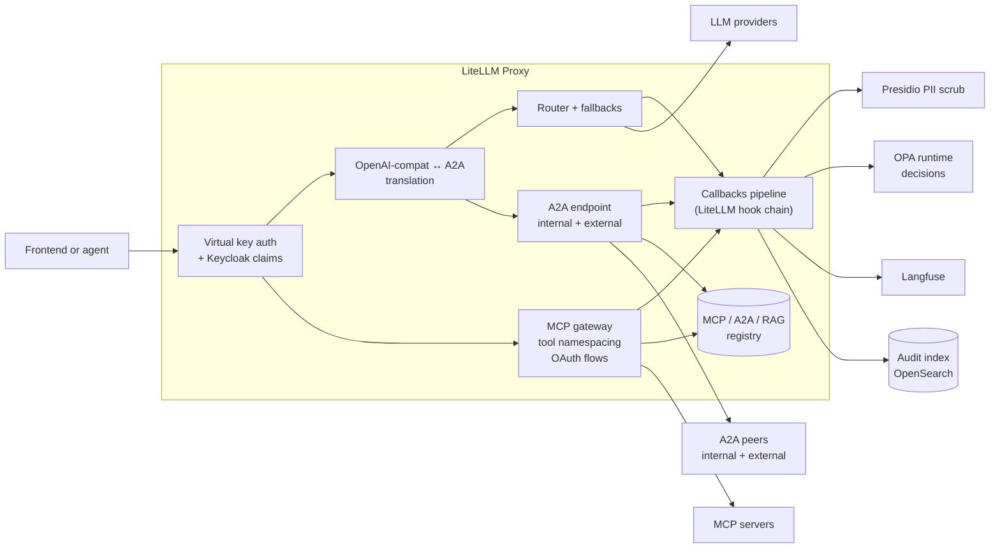

The **callbacks pipeline** is LiteLLM's hook chain — Python callbacks fire at `pre-call`, `post-call`, `success`, `failure`. Each is a class we register. Custom callbacks add PII scrubbing (Presidio), OPA runtime decisions, audit emission to OpenSearch, and Langfuse instrumentation. The pipeline is configured in the LiteLLM ConfigMap; reload-on-change via Reloader.

The **A2A endpoint** accepts internal calls (one Platform Agent calling another) and outbound calls to external A2A peers we have approved. **External organizations do not register A2A peers with us.** When we want to call an external A2A endpoint, an admin defines an `A2APeer` CRD through the Headlamp plugin, which the kopf operator reconciles into LiteLLM's registry. We do not allow outside parties to onboard themselves into our gateway. Same registry, same auth, same audit for all directions.

**Dynamic agent registration.** Platform Agents that expose an A2A or MCP interface to other agents register **dynamically** with LiteLLM at startup, gated by OPA. The Agent CRD declares the intent to expose; OPA checks whether the agent is allowed to expose this interface in its namespace; on success, LiteLLM adds the entry to its registry. Deregistration on agent termination. This makes capability composition fluid — an agent that goes online becomes discoverable to peers without a manual registration step, while still being governed by policy.

**Streaming end-to-end.** Streaming responses are preserved through every layer that supports them: LibreChat ↔ LiteLLM ↔ Platform Agent (whether interactive or triggered/long-running with no UI). LiteLLM's OpenAI-compat ↔ A2A translation preserves stream chunks. Long-running agents that emit incremental output (a multi-step plan, partial results) stream those out through the same path; downstream consumers (a workflow step, an external system, a webhook) receive them as they arrive.

**MCP server health.** LiteLLM monitors MCP connections to the extent the MCP protocol exposes health signals. When an MCP server becomes unhealthy, LiteLLM emits observability signals (metrics, audit events, traces) for the operator surfaces, and surfaces unhealthy status to the Platform Agent the same way a direct connection failure would surface — the agent processes it through its own error path. We do not build a synthetic health-check layer beyond what MCP itself supports.

**LLM provider failover.** Every Platform Agent declares one or more LLM providers in its CapabilitySet (zero providers is rejected at admission validation; this state should not be reachable). Behavior at request time:

- **One provider, available**: use it, no failover.
- **One provider, unavailable**: return error to the agent.
- **Multiple providers, all unavailable**: return error to the agent.
- **Multiple providers, at least one available**: failover silently to the next-priority working provider. The agent does not see the failover.

This keeps behavior predictable. Agents that don't want silent failover declare exactly one provider; agents that need resilience declare an ordered list.

### 6.2 Agent runtime architecture

ARK is the chosen agent operator. Agents declared as `Agent` CRDs reconcile through ARK into pods running inside Sandboxes.

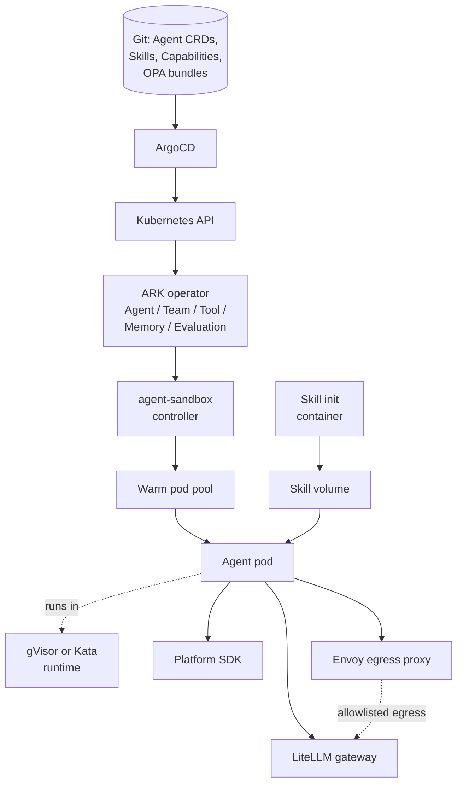

**Skills are managed by LiteLLM's skill gateway.** Skills are stored in Git (which is what LiteLLM's skill gateway already supports) and served to Platform Agents through that gateway, the same way MCP servers and A2A peers are. We do not build a separate skill management system for v1.0; we lean on what LiteLLM already provides. If specific skill management features prove insufficient over time, we revisit then. Skills are **not user-controllable** and are not exposed at the user-facing UI; they are part of the agent's CapabilitySet, configured by admins.

### 6.3 Memory and data architecture

Storage roles are deliberately separate. Postgres is the system of record for state and checkpoints. OpenSearch optimizes retrieval. Object storage is the immutable archive.

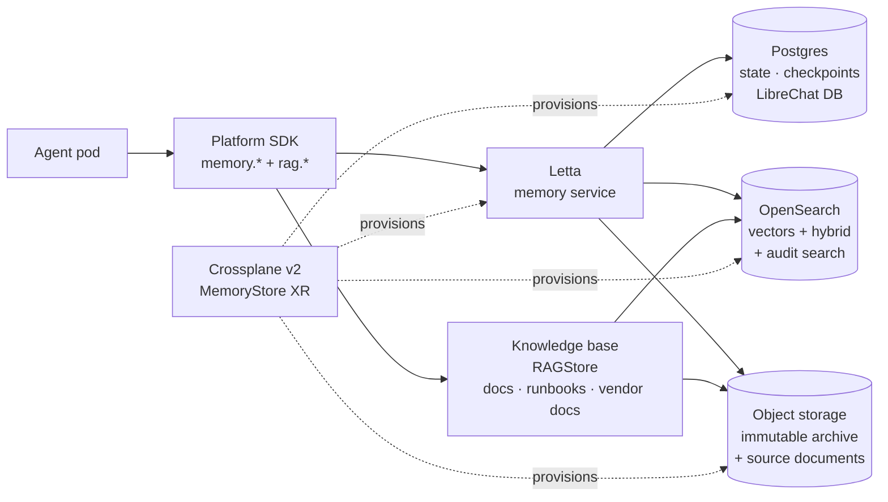

**Rule of thumb**: anything in OpenSearch must be reproducible from a primary source. Vectors and embeddings can be re-derived from documents in object storage. Audit indexes can be re-derived from object-storage archive. Checkpoints live in Postgres (primary); search indexes over checkpoints, if we add them, are derived. This keeps OpenSearch purely as a retrieval-optimization layer, not a system of record.

**Memory access modes.** Each memory store declares one of three access modes:

- **Private to the agent** — only the Platform Agent that wrote it can read it. The default for transient or per-conversation state.
- **Shared by namespace** — any Platform Agent in the same namespace can read it. Useful for tenant-shared context, common project state.
- **RBAC/OPA-controlled** — visibility and read/write controlled by Kubernetes RBAC plus OPA. RBAC grants permissions; OPA may further restrict per-decision (per the platform-wide RBAC-as-floor / OPA-as-restrictor model). Used for cross-namespace shared knowledge or selectively-shared agent memory.

The access mode is part of the `MemoryStore` CRD spec. Agent CRDs reference memory stores by name; the access mode determines what the platform allows.

**Postgres deployment.** Lean on managed Postgres in the cloud provider (RDS / Cloud SQL / Azure Database for Postgres) and use its built-in backup, point-in-time recovery, and replication. This includes the LibreChat database, Letta state, long-running Platform Agent checkpoints, and any other Postgres-resident state. DR procedures get tested as part of the Production Readiness workstream (see section 14.6, Workstream F).

**Audit retention.** Audit logs flow into OpenSearch for searchable short-term retention and are also archived to object storage (S3 or equivalent) for long-term retention. The exact retention policy, lifecycle rules, and redaction strategy are out of scope for v1.0 architecture and assigned to Production Readiness — the architecture establishes the dual-write path; the policy is set when the platform is ready to ship.

### 6.4 The Knowledge Base as a separate primitive

The Knowledge Base is a first-class `RAGStore` named `platform-knowledge-base`. It is **independent of HolmesGPT, Coach, and any other agent** — it is a shared primitive that any Platform Agent may include in its CapabilitySet.

Content sources:

- Our own platform documentation (the MkDocs portal).
- Our per-product architecture-specific docs and runbooks.
- Pinned versions of vendor documentation.

Re-indexing rules:

- For documentation we author, the contributor flags a commit as a major or minor release change. Major and minor changes trigger re-indexing. Patch-level changes do not. This is human-judgment-driven, intentionally — small clarifications and typo fixes don't justify the indexing churn.
- For vendor documentation, acquisition and re-indexing are owned by a **separate companion project** (referenced from this architecture but not part of v1.0 scope). That project periodically scans for vendor version differences and triggers re-indexing on major or minor releases. Architecture references this project; project ownership and links are filled in later.

Access patterns:

- Developers reach the Knowledge Base through LibreChat by talking to the **Interactive Access Agent** — a general-purpose Platform Agent that includes the Knowledge Base in its CapabilitySet and is exposed in LibreChat as the default endpoint. The Interactive Access Agent is implemented early so we use our own infrastructure to let LibreChat reach LLMs from day one.
- HolmesGPT, Coach, and any other Platform Agent that includes the Knowledge Base in its CapabilitySet reaches it the same way — through the SDK's `rag.*` API, going through LiteLLM as part of the standard call path.
- Implementation choice between SDK-API and filesystem mount per agent is design-time (depends on use pattern: semantic queries via SDK, structured grep via mount).

### 6.5 Observability architecture

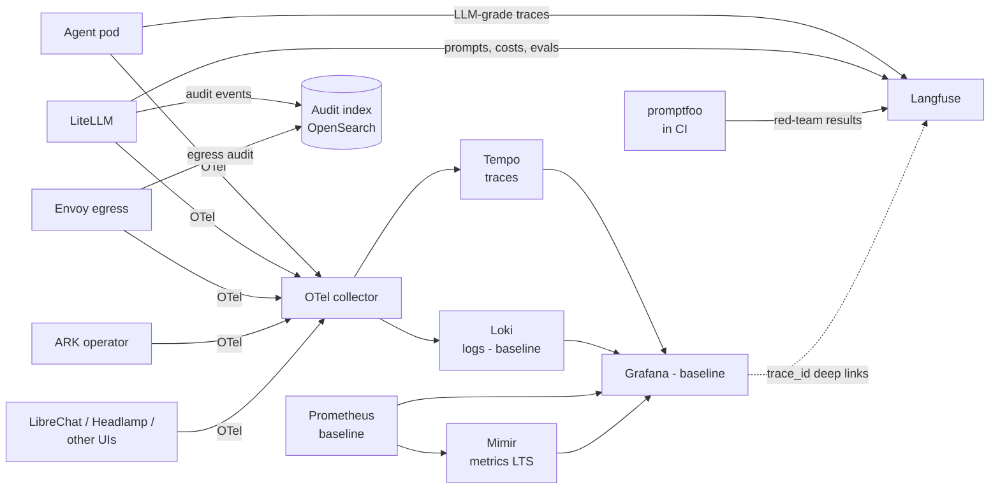

**Tempo and Langfuse correlate by `trace_id`** — every span emitted by the agent SDK and the gateway carries the same trace_id whether it's LLM-flavored or not, so a developer in Grafana can click into Langfuse for prompt-level detail and back. Mimir holds long-term metrics; Prometheus stays as the scrape layer.

**Scope note.** The architecture commits to the observability infrastructure (collection, storage, correlation, per-component dashboards, alert rules for failure conditions) and to broad audit emission. **Operations-metrics work — SLI / SLO definitions, error budgets, reliability summaries, automated alert→remediation loops via HolmesGPT — is deferred to future enhancements** (see `future-enhancements.md`). The collection paths for those metrics exist; the policy and dashboards on top of them are the deferred portion.

### 6.6 Security and policy architecture

#### Threat model — v1.0 stance

The architecture's primary modeled threat for v1.0 is **users or Platform Agents exceeding their authorized access, with a focus on unintentional excess.** Misconfigured capabilities, prompt-injection-driven actions outside intended scope, careless OPA policies, accidental over-broad RBAC grants, and similar mistakes are the dominant concern. The defense-in-depth model — capability scoping at admission, OPA runtime restriction at the gateway, FQDN allowlist at the egress proxy, gVisor / Kata kernel isolation in the sandbox, complete audit emission, RBAC-as-floor / OPA-as-restrictor — is designed primarily against this class of risk.

A **dedicated adversarial threat model** — treating malicious actors as the primary modeling subject rather than mistakes — is a required **design specification deliverable that ships before the first wave of component implementation lands** so its requirements feed forward into every component. It is owned by Workstream B as design (see component **B22** in section 14.2), not as code.

The dedicated threat model design must address at minimum:

- **Adversary classes**: malicious agent author, compromised agent, compromised tenant, compromised admin, compromised LLM or MCP provider, supply-chain compromise (skill artifacts, container images, CRDs), prompt injection from incoming text influencing agent decisions.
- **Asset inventory**: tenant data, secrets, audit integrity, compute, capability registry integrity, identity tokens, the platform's own self-management agents (HolmesGPT, Coach).
- **Trust boundaries**: tenant ↔ tenant, agent ↔ gateway, gateway ↔ provider, sandbox ↔ host kernel, control plane ↔ data plane, internal A2A ↔ external A2A.
- **Specific attack patterns**: capability escape (agent acquires capability not in its set), audit tampering, OPA bypass, sandbox escape, A2A-based lateral movement, exfiltration via approved tools, secret extraction via prompt injection, denial-of-service via budget or capability exhaustion.
- **Per-attack mapping**: which controls apply, what residual risk remains, what observability detects exploitation.
- **Output**: a set of security standards, acceptance criteria, mandatory test cases, and mandatory dashboard signals that every component must meet. The output updates this section, the per-component deliverable lists in Workstream A, and the OPA policy library targets in B16.

The ongoing defense-in-depth model below is the architecture-level commitment; the dedicated threat model refines and extends it.

#### Defense in depth

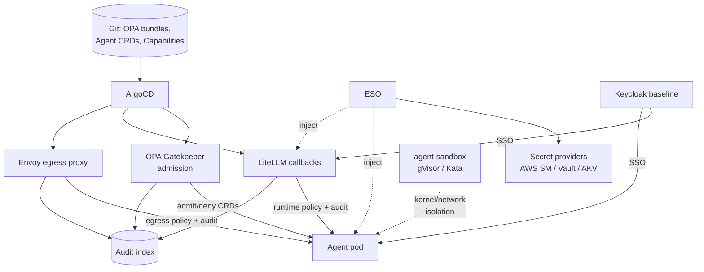

Defense in depth: per-agent allowed capabilities enforced declaratively (Agent CRD + CapabilitySet), at the gateway (virtual key claims + OPA), at the egress proxy (FQDN allowlist + OPA), at the kernel (gVisor or Kata).

#### Self-serve virtual key issuance

Virtual key issuance is self-serve through Headlamp, controlled by RBAC and OPA based on the Keycloak identity of the requestor. A developer or admin requests a key for a specific scope (CapabilitySet binding, budget, environment). OPA decides whether the requestor is allowed to issue that key in that scope, with what limits. Approved keys are returned to the requestor through a secure mechanism (design-time, but the architectural property is: no admin manually issues keys; users do not have to file tickets).

The exact request flow, key delivery mechanism, rotation policy, and scope grammar are design-time decisions. The architectural commitment is that virtual keys are a `VirtualKey` CRD reconciled by the kopf operator, and the issuance flow is a Headlamp-driven, OPA-gated, RBAC-aware self-serve experience.

#### Cost budgets through OPA

Cost budgets are configured **through OPA**, not through LiteLLM's admin UI. The flow:

- A `BudgetPolicy` CRD (or budget data attached to a CapabilitySet — design-time decision) declares the budget for a virtual key, agent, team, or tenant.
- The kopf operator reconciles this into OPA's data and into LiteLLM's budget tracking.
- LiteLLM tracks spend per virtual key (this is built-in functionality).
- On each request, LiteLLM's OPA callback consults OPA: "given current spend and the budget policy, allow this call?" OPA returns allow/deny.
- Headlamp plugin is the editing surface for budgets, just like for any other policy.

This applies generally: anything per-user or per-agent flows through OPA and edits in Headlamp, not through individual tool admin UIs. We want one editing surface across components.

**On LiteLLM's native budget functionality.** Basic budget tracking and per-virtual-key budgets are part of LiteLLM's OSS feature set. Some advanced budget features (alert routing, automated suspensions on threshold) may be enterprise-only — to be confirmed during implementation. If features we need are enterprise-only, we extend through callbacks; the architecture commits to OPA as the policy layer and LiteLLM as the spend-tracking layer regardless.

#### Audit and OPA hook points

Calling these out explicitly so they get implemented as each component lands.

**Audit emission points:**

- LiteLLM callbacks — every request and response, including MCP calls and A2A handoffs. (A17 MCP services ride this path; no separate emission point.)
- Kubernetes admission via Gatekeeper — every CR admit/deny.
- Envoy egress proxy — every outbound HTTP connection.
- Knative broker — event arrival and dispatch outcome.
- ARK operator — Agent / Team / Sandbox / AgentRun lifecycle events.
- agent-sandbox controller — Sandbox creation, destruction, hibernation.
- ESO — secret access (built in).
- ArgoCD — sync events.
- LibreChat — conversation events.
- Headlamp plugin actions — admin operations through our plugins, including virtual-key issuance and budget edits.
- Approval workflows — request created, OPA elevation decision, approver decision, escalation triggered, timeout fired, CloudEvent delivery to requesting agent.
- Coach Component — auto-PR creation, suggestion card emission.
- HolmesGPT — queries run, recommendations made, actions taken.
- LiteLLM kopf operator — capability registry changes (MCPServer, A2APeer, RAGStore, EgressTarget, Skill, CapabilitySet, VirtualKey, BudgetPolicy reconcile events).

**OPA decision points:**

- Kubernetes admission via Gatekeeper — Agent, AgentRun, Sandbox, SandboxTemplate, Memory, MemoryStore, MCPServer, A2APeer, RAGStore, EgressTarget, Skill, CapabilitySet, VirtualKey, BudgetPolicy, Approval, and the Crossplane XRs (AgentEnvironment, SyntheticMCPServer, GrafanaDashboard).
- LiteLLM callbacks — runtime tool/model authorization, rate limiting, content checks, **budget enforcement**.
- LiteLLM dynamic registration — whether a Platform Agent is allowed to register an A2A or MCP interface in its namespace.
- LibreChat — which Platform Agents a user can pick (via Keycloak claims).
- Envoy egress proxy — which destinations are allowed for which agent class.
- Headlamp plugin actions — which admin can approve which suggestion cards, **issue virtual keys**, edit budgets, perform other privileged operations.
- Approval system — required-level elevation evaluation, escalation policy.
- agent-platform CLI — CI pipeline gates: can this PR promote to which environment?
- HolmesGPT — what tools it can invoke, what it can do autonomously vs require human approval.

### 6.7 Eventing architecture (Knative + NATS JetStream)

We use Knative Eventing for the event mesh and NATS JetStream as the broker backend. Same broker in dev and prod. Sources differ per environment (AwsSqsSource on AWS, equivalents on Azure, webhook receivers in kind).

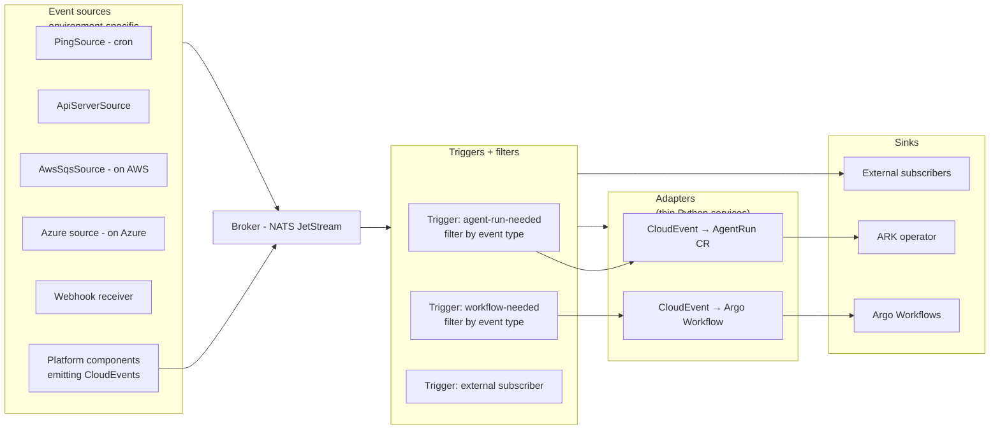

**Filtering happens at the Knative Trigger** (declarative, GitOps-able, audited and policy-checked through Knative). The adapters are pure field-mapping services with no decision logic — one creates an `AgentRun` CR, the other submits an Argo Workflow. This keeps every event flowing through Knative's audit and policy layer.

**CloudEvent standardization across the platform.** All platform events — agent lifecycle, audit events, gateway events, evaluation events — emit as CloudEvents. We maintain a JSON schema registry in Git for our event types (component B12). External systems can subscribe declaratively.

The architecture commits to the following top-level event-type namespaces. Specific event names within each namespace are design-time per component, but every event a platform component emits must fall under one of these.

| Namespace | What it covers |
|---|---|
| `platform.lifecycle.*` | Agent, AgentRun, Sandbox, Workflow, MemoryStore lifecycle (created, started, paused, resumed, completed, failed, deleted). |
| `platform.audit.*` | Audit-emission events from any component (gateway request/response, admission decisions, egress connections, secret access). Mirrors what flows to OpenSearch. |
| `platform.gateway.*` | LiteLLM-specific events that aren't pure audit: routing decisions, provider failover, MCP health changes, A2A handoffs. |
| `platform.policy.*` | OPA decisions, policy violations, dynamic registration accept/deny. |
| `platform.capability.*` | Changes to the capability registry: MCPServer / A2APeer / RAGStore / EgressTarget / Skill / CapabilitySet add/update/delete. |
| `platform.evaluation.*` | Evaluation run started / completed, A/B test results, red-team findings. |
| `platform.approval.*` | Approval requested, OPA-elevated, decided (approved or rejected), escalated, timed out. |
| `platform.observability.*` | Threshold crossings, alert routing (e.g., budget-exceeded notifications, SLA-style alerts). |
| `platform.tenant.*` | Tenant onboarding, namespace association changes, cross-tenant publish events. |
| `platform.security.*` | Security-relevant events distinct from audit: sandbox-escape signal, repeated authn failures, policy-bypass attempts. |

The schema for each event type lives in B12's registry. Schema versioning is per the platform versioning policy (section 6.13).

**Initial trigger flows for v1.0.** Two concrete flows ship with v1.0 to exercise the eventing path end to end and demonstrate the pattern; more flows are designed inside each component as it lands.

- **AlertManager → HolmesGPT.** Alerts from AlertManager (and any other monitoring alert system in the cluster) route into Knative as CloudEvents. A Trigger filters for diagnostic-relevant alerts (cluster cannot schedule pods due to resource constraints, high error rates, sustained gateway latency) and dispatches to HolmesGPT to investigate. HolmesGPT produces findings, suggestions, or auto-PRs through its normal flow.
- **Budget exceeded → email user.** A LiteLLM callback emits a CloudEvent when a virtual key exceeds its budget. A Trigger filters for budget events and dispatches to a notification adapter that emails the affected user. This exercises the "platform component emits CloudEvent → Trigger → side-effect" path without requiring a Platform Agent in the middle.

**Each subsequent component is expected to design its own trigger flows** as part of standard component deliverables (alongside Headlamp plugin, OPA integration, audit emission, observability, tests). Flow design = identifying what events the component emits, what events it consumes, and what Triggers route between them. This is how the eventing fabric grows organically without big-bang design.

### 6.8 Capability registries and approved primitives

The concept of "approved MCP server" or "approved A2A peer" has architectural implications well beyond the gateway: it affects policy decisions, observability tagging, agent template configuration, egress allowlists, secret management. Treating these as architectural primitives rather than gateway-internal config is the cleanest model.

Each is a Kubernetes CRD reconciled by the custom Python kopf operator into LiteLLM and into other components.

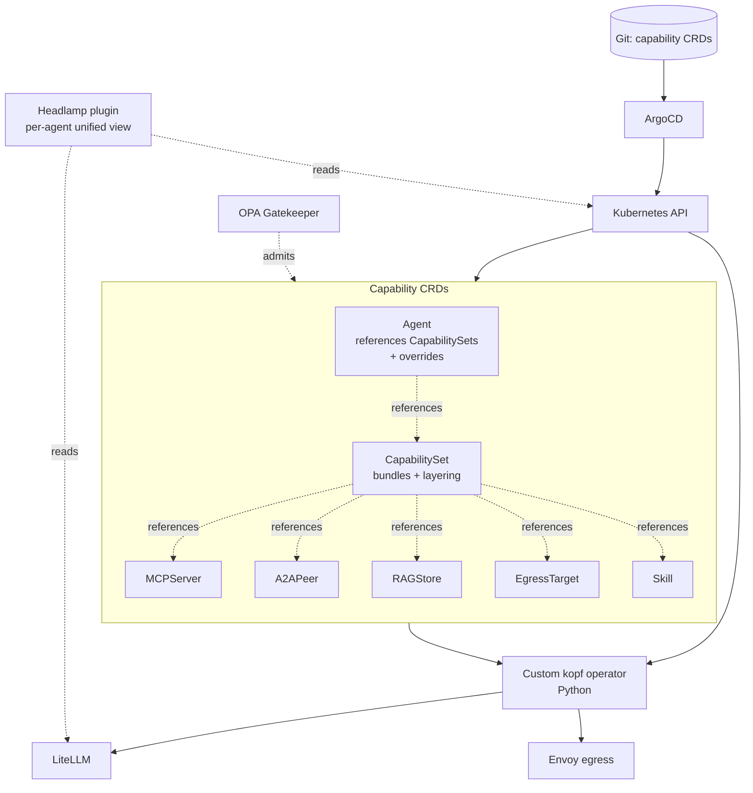

**CapabilitySet layering** uses a Helm-style values-overlay model with the following committed semantics:

- CapabilitySets referenced by an Agent are processed **one at a time, in declared order**.
- For each set, for each top-level field: **if the field is not yet present in the resolved state, add it; if it is present, replace it.** This is field-level Helm overlay — a later set's value for a field fully replaces an earlier set's value for that same field. Lists are not concatenated by default; to extend a list from a parent set, the overlay restates the full list it wants.
- After all referenced sets are resolved, the **per-Agent overrides apply last**, with the same add-if-not-there / replace-if-there semantics.

Detailed semantics that remain design-time: recursive includes (whether a CapabilitySet may reference other CapabilitySets), validation rules for missing or deleted references, namespace boundaries on cross-references, and whether per-Agent overrides may grant capabilities not present in any referenced set. The architectural commitment is the layering model above; syntax and mechanics around it are design.

A small pseudocode sketch of how layering would resolve, just to illustrate the model:

```yaml
# baseline-readonly capability set
mcp_servers:    [confluence-readonly, jira-readonly]
llm_providers:  [anthropic-claude, openai-gpt5]
egress_targets: [internal-api]
opa_policy_refs: [base-restrictions]

# customer-support overlay — full lists, replaces baseline values
mcp_servers:    [confluence-readonly, jira-readonly, zendesk]
egress_targets: [internal-api, customer-portal]
opa_policy_refs: [base-restrictions, rate-limit-strict]
# llm_providers not specified → stays from baseline

# Agent X
capability_sets: [baseline-readonly, customer-support]
overrides:
  egress_targets: [internal-api, customer-portal, observability-api]

# Final resolved capability for Agent X
mcp_servers:    [confluence-readonly, jira-readonly, zendesk]
llm_providers:  [anthropic-claude, openai-gpt5]
egress_targets: [internal-api, customer-portal, observability-api]
opa_policy_refs: [base-restrictions, rate-limit-strict]
```

The point is that capabilities compose declaratively from a library of profiles, with predictable replace-then-override resolution, and a tooling surface (Headlamp) that shows the resolved view.

**Headlamp plugin** for capabilities renders the unified per-agent view: for `Agent X`, here are all MCP servers, A2A peers, RAG stores, egress targets, skills, and OPA policies that apply, regardless of which CapabilitySet contributed them. Reads come from Kubernetes (CRDs) and LiteLLM (current applied state).

### 6.9 Multi-tenancy and namespacing

Tenancy is built around Kubernetes namespaces. A tenant maps to one or more namespaces; the namespace boundary is the tenancy boundary. This applies to Platform Agents, the CRDs they reference, the Sandboxes they run in, and the audit and observability data they emit.

**Tenancy is established through Keycloak claims.** A user's tenant membership, accessible namespaces, and platform roles are all carried as JWT claims minted by Keycloak. Keycloak in turn uses **mappers** to translate identity attributes from the upstream identity provider (AD groups, Okta groups, etc.) into the platform's claim schema. Building those mappers is **out of scope** for this architecture — that work is the responsibility of whoever administers the platform install, since their choice of upstream IdP determines the source attributes. The architecture commits only to the **claim schema Keycloak must emit**, summarized below.

#### Required Keycloak JWT claims

| Claim | Type | Required | Purpose |
|---|---|---|---|
| `sub` | string | yes | Subject identity (user or service-account principal). |
| `iss` | string | yes | Issuer; must be the platform's Keycloak realm. |
| `aud` | string or array | yes | Audience; one of the platform service identifiers (gateway, headlamp, etc.). |
| `exp`, `iat`, `nbf` | int | yes | Standard JWT lifetime claims. |
| `email` | string | for users | User email; absent for service-account principals. |
| `preferred_username` | string | yes | Display name used in UIs and audit. |
| `platform_tenants` | array&lt;string&gt; | yes | Tenants the principal belongs to. Empty array means "no tenant context" (cross-tenant platform admins are still scoped via roles, not absence of this claim). |
| `platform_namespaces` | array&lt;string&gt; | yes | Kubernetes namespaces the principal may operate in. Authoritative for OPA decisions on resource scope. |
| `platform_roles` | array&lt;string&gt; | yes | Platform-level roles: `platform-admin`, `operator`, `developer`, `viewer`, `auditor`, etc. Specific role catalog is design-time; this claim's presence and shape is architecture-level. |
| `tenant_roles` | object&lt;tenant, array&lt;role&gt;&gt; | for tenant-scoped principals | Per-tenant role mappings (e.g., `{tenant-a: [admin], tenant-b: [developer]}`). Empty for purely platform-level principals. |
| `capability_set_refs` | array&lt;string&gt; | for service-account principals (Platform Agents) | CapabilitySets the principal is permitted to bind to. Used by OPA to gate dynamic registration and virtual-key issuance. |

These claims are consumed by LiteLLM (auth + virtual-key claim binding), OPA (every policy decision that depends on identity), Headlamp (UI scoping), and LibreChat (endpoint visibility). RBAC remains the authoritative permission floor; OPA may further restrict per-decision based on these claims.

#### Visibility model

Within a namespace, Platform Agents that expose an A2A or MCP interface to other agents register **dynamically** with LiteLLM at startup — the agent advertises itself through the gateway's registration API, gated by OPA policy that decides whether this agent is allowed to expose this interface. Once registered, other Platform Agents can discover and call it according to whatever policy says they may.

The cross-namespace and intra-namespace visibility model is policy-driven, not implicit:

- A namespace's agents can be **read-only-visible** to all other tenants (they can be discovered and called for reads, not writes).
- A namespace's agents can be **read-write-visible** to specific other tenants based on RBAC + OPA policy.
- A namespace's agents can be **invisible** outside the namespace (the default for tenant-private agents).

This is enforced at three layers, defense-in-depth:

- **Agent CRD admission** (Gatekeeper) — admit only agents that comply with the namespace's tenancy rules.
- **LiteLLM gateway** (OPA callback) — runtime authorization on every A2A call, "may caller in tenant A invoke callee in tenant B?"
- **Network policy** at the Envoy egress proxy level — even if the gateway authorization fails, network-level policy prevents the call.

Cross-tenant resource sharing (a `CapabilitySet` defined in one namespace and referenced from another) is allowed only when explicitly published with an OPA-checked policy. Default is namespace-private.

The same model applies to dynamic agent registration: an agent can request registration as A2A or MCP exposing in any namespace it has admission rights for, and OPA decides whether the registration is allowed and what visibility it gets. Admin override happens through Headlamp plugin (force-register or force-deregister).

### 6.10 Platform self-management with HolmesGPT

HolmesGPT is a Platform Agent (Agent CRD) — administered like any other agent. It has broad **read-only** access to platform state including OPA policies, audit data, traces, metrics, and the Knowledge Base. Write actions (auto-PRs, suggestion cards, autonomous remediations) are policy-controlled. It goes in **as early as possible** — even before the full observability stack is wired — because it can be useful for diagnostics during platform implementation itself, even with limited connectivity. Each subsequent component contributes a toolset to it as that component is implemented; by the time the platform is mature, HolmesGPT has a complete picture.

The Knowledge Base (`platform-knowledge-base` RAGStore) is **a separate primitive that HolmesGPT uses, not a part of HolmesGPT**. Any Platform Agent that includes the Knowledge Base in its CapabilitySet has the same access. This is why the Interactive Access Agent (a general-purpose chat-facing Platform Agent) and HolmesGPT both query the same store.

HolmesGPT exposes an **A2A interface**. Other Platform Agents can hand off troubleshooting questions to it; implementers can point it at things they want analyzed. Calls into HolmesGPT go through LiteLLM and are subject to the same auth and audit as any other agent call.

A note on HolmesGPT having read access to the OPA policies that gate it: this is intentional. One of its jobs is to analyze the policies themselves for loopholes, gaps, and contradictions. There is a self-referential risk — HolmesGPT could in principle use its own visibility to identify a way around its own constraints — but if that's possible, we want it found and fixed, not left as an undiscovered vulnerability. We accept the trade-off.

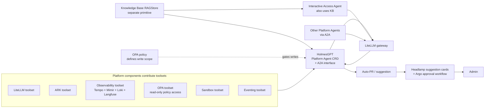

HolmesGPT's autonomy is policy-controlled. Initially: read-only diagnostics, propose changes via auto-PR or suggestion card. Later, narrow remediations execute autonomously when OPA allows. The audit trail is the same as any other agent.

### 6.11 Identity federation

The platform has three identity domains that need to be tied together: Kubernetes service accounts (running pods, including Platform Agents), cloud-provider identity (for IRSA / Workload Identity-style access to cloud secret stores and other cloud resources), and Keycloak-issued JWTs (the platform's authoritative identity for OPA decisions, virtual key claims, and UI access).

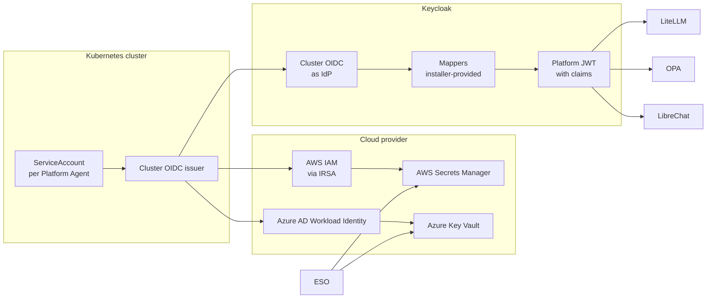

**The chain of trust** for a Platform Agent making a privileged call:

1. The agent's pod runs as a Kubernetes ServiceAccount with a projected token signed by the cluster's OIDC issuer.
2. **Cloud-side**: ESO (or any in-cluster process needing cloud access) uses that SA token to assume a cloud identity — **AWS IRSA** (SA annotated with `eks.amazonaws.com/role-arn`, AWS STS recognizes the cluster as an OIDC provider, returns scoped AWS credentials) or **Azure Workload Identity** (SA annotated with `azure.workload.identity/client-id`, Azure AD recognizes the cluster as an OIDC issuer, returns scoped Azure credentials). Both Azure and AWS implement this OIDC-based federation pattern; functionally equivalent for the architecture's purposes.
3. **Platform-side**: the SA token is exchanged (via standard OIDC token exchange) for a Keycloak-issued platform JWT. Keycloak federates the cluster OIDC issuer as an Identity Provider and applies the installer-configured mappers to enrich the resulting platform JWT with the claim schema in section 6.9 (`platform_tenants`, `platform_namespaces`, `platform_roles`, `capability_set_refs`, etc.).
4. The platform JWT is what LiteLLM, OPA, Headlamp, and LibreChat actually consume.

**For human users**, the chain skips step 2 — the user logs in to Keycloak through the UI, Keycloak brokers the upstream IdP (AD, Okta, etc.), mappers populate the same claim schema, and the resulting JWT is presented to platform components.

**Trust bootstrap.**

- **AWS (v1.0 initial implementation)**: ESO uses an IRSA-bound ServiceAccount to fetch Keycloak admin credentials, JWT signing keys, initial database passwords, and other bootstrap secrets from **AWS Secrets Manager**. The IRSA trust is established once during cluster provisioning by the `k8-platform` baseline.
- **Azure (architecture-supported, not exercised in v1.0)**: equivalent pattern with **Azure Workload Identity** + **Azure Key Vault**. Specifics are TBD until v1.0 lands and Azure becomes a real target.
- **kind / dev**: the cluster runs without cloud federation; ESO is configured against a local secret backend or the secrets are provided directly. Bootstrap is local.

**What the architecture commits to:**

- All privileged platform identity flows ultimately resolve to a Keycloak-issued JWT carrying the section 6.9 claim schema. No platform component trusts upstream identity directly.
- Cluster OIDC is the SA federation root; IRSA / Workload Identity is the cloud-resource adapter; Keycloak is the platform identity adapter.
- Mapper authoring (translating upstream IdP attributes into platform claims) is **out of scope**; architects of a specific install own it.
- Initial v1.0 implementation is AWS + GitHub. Azure parity is a configuration concern, not an architectural one.

### 6.12 CRD inventory

A summary of every CRD in the architecture, who reconciles it, and where it is discussed in detail. High-level attributes are listed here; the full schema lives with each CRD's reference documentation (section 10.3).

| CRD | Reconciler | Scope | Summary | Key attributes | Discussed in |
|---|---|---|---|---|---|
| `Agent` | ARK | namespaced | A Platform Agent declaration. | `capabilitySetRefs[]`, `overrides`, `sdk`, `image`, `sandboxTemplateRef`, `memoryRefs[]`, `modelRef`, `triggers`, `exposes` (A2A/MCP) | §6.2, §6.8 |
| `AgentRun` | ARK | namespaced | A single execution of an Agent, created by Knative event adapters or workflow steps. | `agentRef`, `inputs`, `traceId`, `triggeredBy`, `state` | §6.7, §7.2 |
| `Team` | ARK | namespaced | A coordinated multi-agent grouping. | `members[]`, `coordinationStrategy` | §5 (component A5) |
| `Tool` | ARK | namespaced | An ARK-native tool definition. | (defers to ARK) | §5 (component A5) |
| `Memory` | ARK | namespaced | An agent-scoped memory binding. | `memoryStoreRef`, `accessMode` | §6.3 |
| `Evaluation` | ARK | namespaced | An agent evaluation specification. | `agentRef`, `datasetRef`, `evaluators[]` | §5 (component A5), §7.4 |
| `Query` | ARK | namespaced | An ARK-native query primitive. | (defers to ARK) | §5 (component A5) |
| `Sandbox` | agent-sandbox | namespaced | A sandbox instance running agent pods. | `templateRef`, `runtime` (gVisor/Kata), `state` | §6.2 |
| `SandboxTemplate` | agent-sandbox | namespaced | A reusable sandbox class definition. | `runtime`, `warmPoolSize`, `hibernationEnabled`, `resourceLimits` | §6.2 |
| `MCPServer` | kopf (B13) | namespaced | An approved MCP server registered with the gateway. | `endpoint`, `authMode` (system/user-cred), `credentialsRef`, `tags`, `scopes`, `visibility` | §6.1, §6.8 |
| `A2APeer` | kopf (B13) | namespaced | An approved A2A peer (internal or external). | `endpoint`, `direction` (internal/external), `auth`, `tags` | §6.1, §6.8 |
| `RAGStore` | kopf (B13) | namespaced | A RAG-capable store (vector + hybrid). | `backend`, `indexes[]`, `contentSourceRefs[]`, `ingestionPipelineRef` | §6.4, §6.8 |
| `EgressTarget` | kopf (B13) | namespaced | An approved outbound HTTP destination. | `fqdn`, `port`, `scheme`, `allowedMethods` | §6.1, §6.8 |
| `Skill` | kopf (B13) | namespaced | A skill artifact reference (managed via LiteLLM's skill gateway). | `gitRef`, `versionPin`, `schemaRef` | §6.2, §6.8 |
| `CapabilitySet` | kopf (B13) | namespaced | A bundled, layerable set of capabilities. | `mcpServers[]`, `a2aPeers[]`, `ragStores[]`, `egressTargets[]`, `skills[]`, `llmProviders[]`, `opaPolicyRefs[]` | §6.8 |
| `VirtualKey` | kopf (B13) | namespaced | A LiteLLM virtual key bound to a CapabilitySet and identity. | `ownerIdentity`, `capabilitySetRef`, `budgetRef`, `environment`, `allowedModels[]`, `ttl` | §6.6 |
| `BudgetPolicy` | kopf (B13) | namespaced | A budget specification consumed by OPA + LiteLLM. | `scope` (key/agent/team/tenant), `period`, `limits`, `thresholdActions[]` | §6.6 |
| `Approval` | Argo Workflow + B19 | namespaced | A request for human approval of an agent-proposed action. | `requestingAgent`, `actionType`, `actionAttributes`, `defaultLevel`, `evidenceRefs[]`, `decision`, `decidedBy`, `decidedAt` | §7.5 |
| `MemoryStore` (Crossplane XR) | Crossplane (B4) | namespaced | A composed memory backend resource. | `accessMode` (private/namespace-shared/RBAC-OPA), `backendType` | §6.3 |
| `AgentEnvironment` (Crossplane XR) | Crossplane (B4) | namespaced | A composed environment for a class of agents. | `region`, `quotas`, `defaultCapabilitySetRef` | §5 (component B4) |
| `SyntheticMCPServer` (Crossplane XR) | Crossplane (B4) | namespaced | An MCP server synthesized from an OpenAPI spec. | `openApiSpecRef`, `authConfigRef`, `mcpServerRef` (back-link) | §5 (component A12) |
| `GrafanaDashboard` (Crossplane XR) | Crossplane (B4) | namespaced | A namespaced dashboard. | `dashboardJson`, `folder`, `visibility` (RBAC + OPA-controlled) | §11 |

All CRDs are namespaced. There are no cluster-scoped platform CRDs in v1.0.

### 6.13 Versioning policy

The platform exposes several distinct API surfaces that all need explicit versioning. The architecture commits to a versioning model for each; specific bump/deprecation timing is per-component design.

| Surface | Versioning approach | Owner |
|---|---|---|
| **CRDs** | Kubernetes API versioning (`v1alpha1`, `v1beta1`, `v1`); breaking changes go through a new `vN` group with conversion webhooks; `vN-1` deprecated for at least one minor platform release before removal. | The component that owns the CRD's reconciler — kopf operator (B13) for capability/key/budget CRDs, ARK install (A5) for ARK CRDs, agent-sandbox install (A6) for sandbox CRDs, Crossplane compositions (B4) for XRs, B19 for Approval. |
| **CloudEvent schemas** | Schemas in B12's registry carry `specversion` (CloudEvents-native) plus a per-event-type `schemaVersion` field. Backward-compatible additions bump minor; breaking changes mint a new event type rather than breaking subscribers. | B12 owns the registry; each component owns its event types. |
| **Platform SDK (Python + TypeScript)** | Semantic versioning. Major bumps signal SDK API breaks; minor bumps are additive; patch is bugfix. SDK ships with a version-pinned compatibility matrix against gateway / ARK / Letta versions. | B6. |
| **`agent-platform` CLI** | Semantic versioning. Subcommand surface is the versioned API; flag-level changes follow deprecation-warning conventions. | B9. |
| **A2A and MCP interfaces exposed by Platform Agents** | Each agent declares a version on its exposed interface (e.g., `myAgent.v1`); peers pin a major version. Breaking changes ship as a new major and run side-by-side until peers migrate. | The component shipping the agent (each agent in B17 / B18 owns its exposed interface). |
| **HTTP APIs exposed by custom services** (kopf operator admin, Knative adapters, audit pipeline, etc.) | URL-path versioning (`/v1/...`); deprecated versions remain reachable for at least one platform release after replacement. | Each owning component. |

**Component responsibility.** Versioning is **not a centrally-coordinated activity**. Each component owns its own surfaces and is responsible for:

- Declaring the current version of every API it exposes.
- Documenting compatibility with adjacent versions (which Platform SDK works with which gateway, etc.) in its per-product documentation (section 10.5).
- Emitting deprecation warnings (logs, metrics, audit events) when callers use deprecated versions.
- Providing migration guidance in the per-product docs.

The architecture does not prescribe a synchronized "platform release" version that bumps everything in lockstep; components evolve independently within the compatibility matrix.

## 7. Use cases

Each use case has two diagrams: an architecture view showing which components participate, then a sequence view showing how interactions flow.

### 7.1 Interactive chat

End user chats with a Platform Agent through LibreChat. LibreChat is locked down (no native agents, no plugins, no per-conversation MCP, no file uploads) and serves only as the chat frontend. Platform Agents appear in LibreChat's endpoint picker as if they were models, surfaced through LiteLLM. Skills, tools, MCP, and RAG are configured on the agent server-side and are not visible to or controllable by the user.

The default endpoint a typical user sees is the **Interactive Access Agent** — a general-purpose Platform Agent that includes the Knowledge Base in its CapabilitySet and offers conversational access to platform information. Other Platform Agents may be exposed as additional endpoints depending on tenancy and RBAC.

**OpenAI ↔ A2A translation.** This translation between LibreChat's OpenAI-compatible HTTP and our A2A-spoken Platform Agents is expected to be handled by LiteLLM directly. If LiteLLM doesn't provide this translation in OSS by the time we install it, we add a small adapter service (Python) between LibreChat and LiteLLM as part of the LibreChat install/configure component. Either way, LibreChat itself is unmodified.

**Streaming.** Responses stream end-to-end: LLM provider → LiteLLM → Platform Agent → LiteLLM → LibreChat → user, with stream chunks preserved at every layer. The same path applies in reverse for streaming inputs.

**Architecture:**

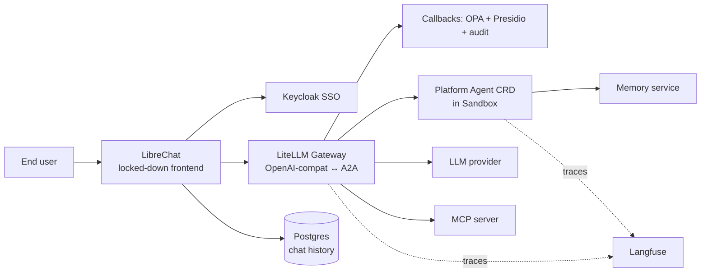

**Sequence:**

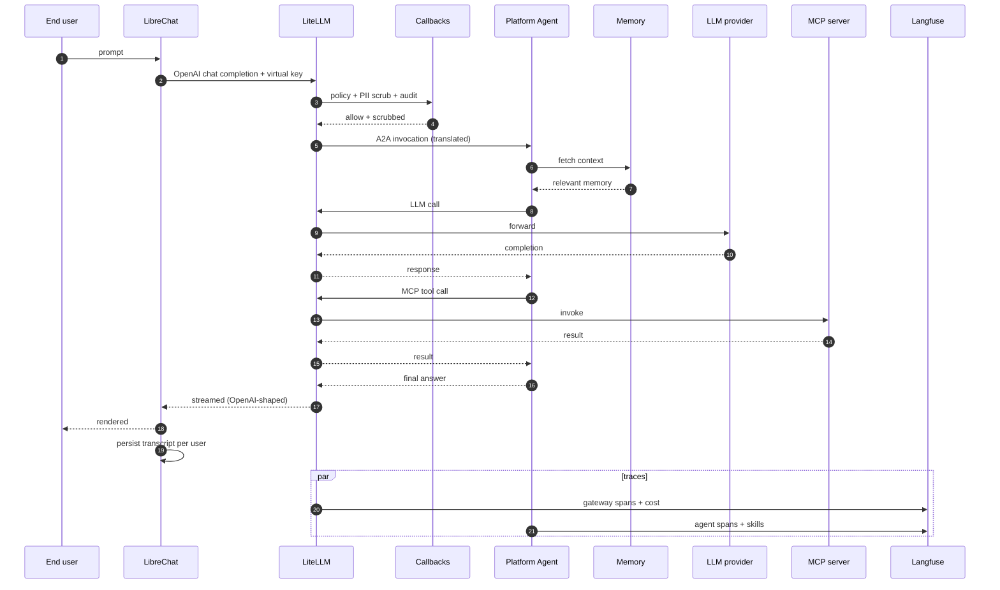

### 7.2 Triggered and long-running

Scheduled, event-driven, and durable execution. Knative Trigger filters route events; thin adapters create the right resource; Argo Workflows or ARK runs the work; agent-sandbox enables pause/resume; checkpoints land in Postgres.

**Streaming applies here too.** A long-running Platform Agent that emits incremental output (multi-step plans, partial results, progress updates) streams those out through the same LiteLLM-mediated path that interactive agents use. Downstream consumers — workflow steps, external systems, webhooks — receive chunks as they arrive rather than waiting for completion. The absence of a UI doesn't change the underlying transport.

**Architecture:**

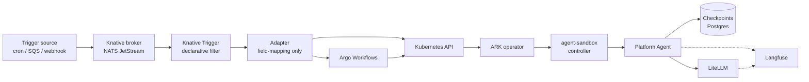

**Sequence:**

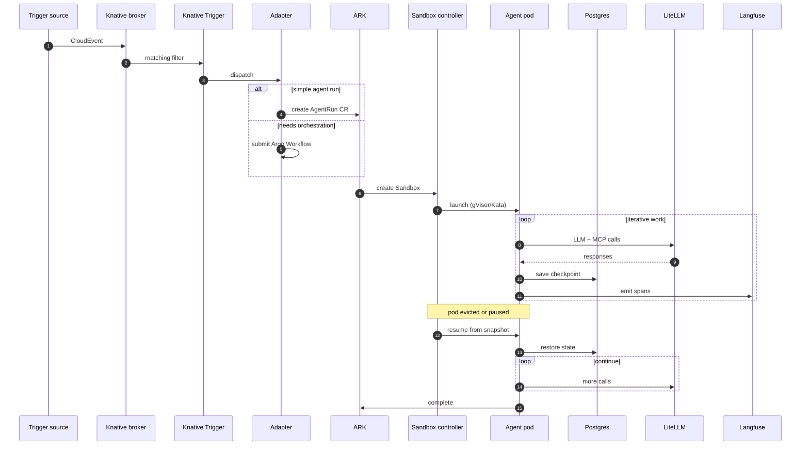

### 7.3 MCP tool invocation

A single MCP call, showing every enforcement point. Egress passes through Envoy (LiteLLM is the proxy for MCP/LLM/A2A; for any other outbound the Envoy proxy applies).

**Architecture:**

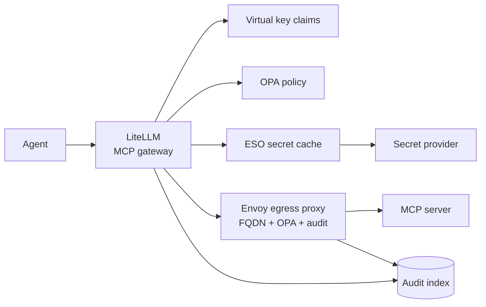

**Sequence:**

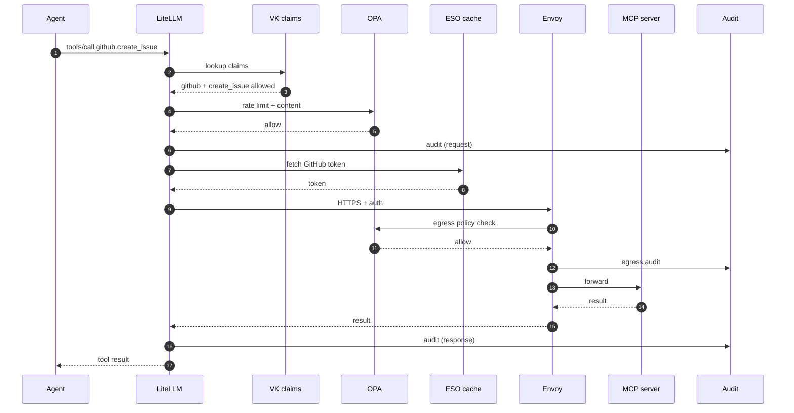

### 7.4 Developer iteration via GitOps

A skill, prompt, or capability change flows through Git → CI evals → ArgoCD reconcile. The custom Python kopf operator keeps LiteLLM in sync with capability CRDs.

**Architecture:**

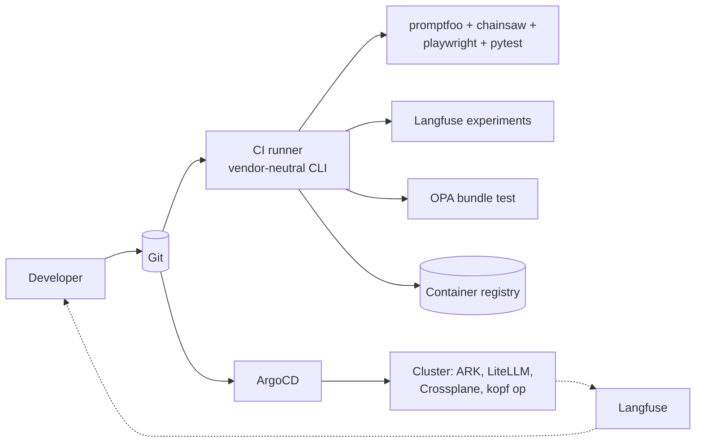

**Sequence:**

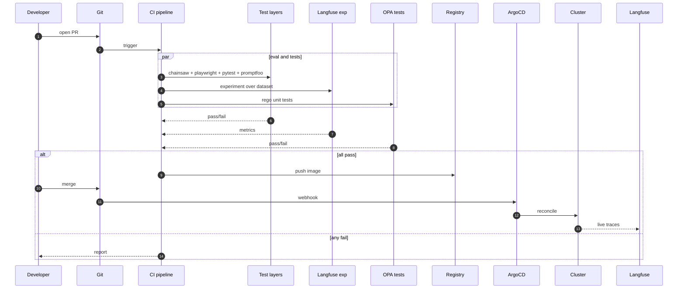

### 7.5 Approvals — generalized

Approvals are for actions taken by Platform Agents that require human review before proceeding. The mechanism is intentionally lean — Argo Workflows handles the workflow mechanics; a Headlamp plugin provides the approval UI; OPA decides who can approve a given action. The architectural primitives are small, but the model is general so we can wire any new approval need into the same machinery without rebuilding it.

**Approval primitives:**

- An `Approval` CRD represents a request for action. Fields include the requesting agent, the action attributes (what is being proposed, including all metadata needed to act on the proposal independently if approved), the default approval level (e.g., `operator`), and links to evidence (traces, audit, RAG references).
- When an `Approval` is created, OPA is consulted. OPA can **only elevate** the required approval level — for example, an action whose default is `operator` may be elevated to `org-admin` if OPA determines the action operates on sensitive data. OPA cannot lower the bar.
- The `Approval` enters a workqueue surfaced through the Headlamp plugin to anyone with the resolved permission level.
- Approve and reject both produce an audit trail entry and a CloudEvent routed to the requesting agent. The agent, on receiving the result event, takes its action (or doesn't) using the metadata in the original request.
- The Argo Workflow underneath manages the suspend/resume mechanics and the timeout / escalation behavior.

**RBAC/OPA semantics for approvals (and elsewhere).** Throughout the platform, RBAC is the standard authorization layer; OPA is the policy layer that **can only restrict** what RBAC has granted. OPA never grants permissions RBAC didn't already give. This applies to approval levels (OPA can elevate the required level — i.e., deny the originally-permitted approver from being sufficient), to virtual key issuance, to capability access decisions, and across the platform. The mental model: RBAC is the floor; OPA may raise the floor on a per-decision basis.

**Initial use cases** for the approval system in v1.0: Coach Component–suggested skill changes, HolmesGPT–suggested remediation actions. Other use cases get added by writing an `Approval` request from the agent that needs review — no new mechanism required.

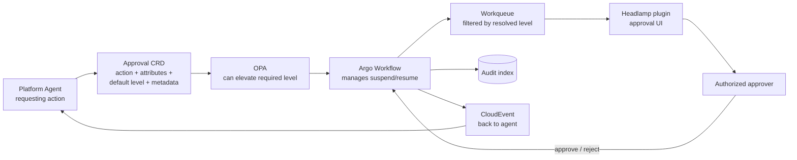

**Sequence:**

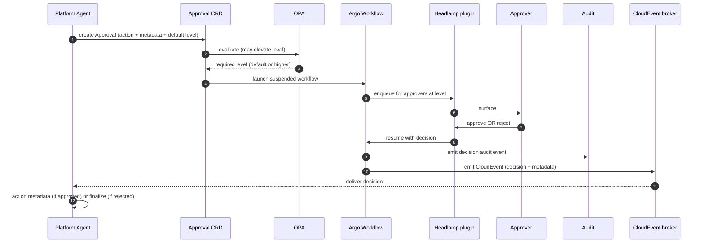

The architecture commits to keeping this thin. We don't build M-of-N approvers, complex routing rules, escalation timers, or approval delegation in v1.0 — the request specifies a level, OPA may elevate it, anyone with that level can decide. If we discover we need more, we add it where the mechanism already lives (Argo Workflows behaviors, OPA rules, Headlamp UI), not by rebuilding.

## 8. CI/CD integration requirements

**v1.0 supports GitHub Actions only.** Jenkins, GitLab CI, and other CI systems are explicitly out of scope for v1.0; the platform is designed so that adding them later is mechanical (the `agent-platform` CLI is the integration surface, not native pipeline templates), but no work toward them happens in v1.0.

We use **option 2** (unified CLI tasks called from native pipelines): the same `agent-platform` CLI image runs in CI; pipeline definitions are native to GitHub Actions and call the same commands. The CLI is the contract; pipelines are syntax around it.

**What the platform provides to CI:**

- An `agent-platform` CLI as a container image. Subcommands: `validate`, `eval`, `redteam`, `package`, `test`, `deploy-preview`, `promote`, `scan`, `update-base`.
- A reference GitHub Actions pipeline, in the doc portal as a how-to guide.
- A schema for required environment variables and secrets.
- A list of network endpoints CI runners need to reach (Langfuse, Git, container registry, ArgoCD, OPA bundle store, OpenSearch).

**What CI is responsible for:**

- Implementing orchestration in its native format.
- Storing encrypted secrets.
- Triggering on PR, push, tag, schedule, manual dispatch.
- Posting results back as PR comments and commit statuses.

**Container maintenance pipeline.** A scheduled CI workflow keeps the agent base image current: rebuild with latest base + OS + language deps, run security scans (Trivy or Grype, block on critical CVEs), run regression eval suite, tag new image, open PR to bump references in Agent CRDs. Triggered out-of-cycle for critical CVEs.

**Security-first pipeline design.** The CI/CD pipeline is itself a privileged component — it has push access to the registry and merge-trigger access to GitOps reconciliation — and is designed with that in mind from the start. The reference GitHub Actions pipeline ships with: scoped tokens (no long-lived static credentials; OIDC federation to AWS where possible, GitHub Environments to gate production-affecting jobs), pinned action versions and SHA-pinned third-party actions, separate runners for build vs deploy where the deploy runner has elevated trust, and signed artifacts. Required scan steps (Trivy / Grype on images, dependency scanning on language packages, OPA bundle linting, schema validation on CRDs and CloudEvents) are part of the reference pipeline and gated as required checks. Hardening of the pipeline beyond v1.0 — admission-time enforcement of scan-artifact presence, continuous scanning of running images, image signing and attestation — is in the future-enhancements document.

## 9. OSS limitations and required custom development

Most components are OSS and fit well, but several have features behind a commercial license. The most consequential is **single sign-on**: many OSS tools either lack SSO or only support OAuth-with-built-in-user-store, neither of which works against Keycloak fronting AD or Okta.

We fill these gaps with recurring patterns, all custom development:

- **Auth proxy in front** — `oauth2-proxy` configured against Keycloak fronts the tool's UI.
- **Augment via API or callback** — for tools with hooks but missing features.
- **Glue services** — small custom services that bridge missing integrations.
- **Headlamp plugins** as the unified admin UI to compensate for missing per-product UIs.

| Tool | OSS limitation | Fill-in we build |
|---|---|---|
| LiteLLM | SSO/SAML enterprise-only | `oauth2-proxy` in front of admin UI against Keycloak. Two or three admin classes via Keycloak group claims — we don't need fine-grained RBAC. |
| LiteLLM | Fine-grained audit and RBAC enterprise-only | Custom Python callbacks emit structured audit events to OpenSearch. OPA admission for sensitive virtual key admin operations. We don't need fine-grained RBAC — two or three admin classes via Keycloak group claims suffice. |
| LiteLLM | Org-level guardrails enterprise | Custom Python callbacks for PII, content policy, OPA-driven rate limits. |
| LiteLLM | Advanced budget features (alert routing, automated suspension on threshold) may be enterprise; basic per-key budgets are OSS | Architecture commits to OPA as policy layer + LiteLLM as spend tracker. Anything missing from OSS gets added via callback. Headlamp is the editing surface; OPA enforces. |
| LiteLLM | No native Crossplane provider | Hand-written Python kopf operator reconciles CRDs to LiteLLM admin API. |
| Langfuse | Some advanced RBAC, audit, and SCIM features paid | Use API + scripts; auth proxy or OIDC for SSO; thin SCIM bridge if needed. |
| LibreChat | Native agent feature, plugins, MCP, file upload could leak platform/user boundaries | Lock down via `librechat.yaml` config; only the endpoint picker and chat history remain user-visible. |
| Headlamp | OIDC supported but plugin gating is DIY | Plugin gating logic in our plugin code (Keycloak claims). |
| Argo Workflows / ArgoCD | OIDC works against Keycloak; multi-tenant Workflows console is basic | OIDC config; high-level cross-environment views via Headlamp plugins. |
| ARK | Technical-preview status; multi-tenancy and per-tenant RBAC may be thin | Pin a tested version. Plan for upstream contributions. Namespace-based isolation + OPA admission + Headlamp plugin for cross-tenant visibility. |
| Knative Eventing | No native sink for Argo Workflows or for `AgentRun` | Two thin Python adapter services (CloudEvent → resource); filtering happens at Knative Trigger. |
| Knative Eventing | Production needs a real broker backend | NATS JetStream installed and operated, same in dev and prod. |
| OPA / Gatekeeper | No central policy management UI | Headlamp plugin for policy review and bundle management. |
| Crossplane v2 | Console (Upbound) is commercial | Headlamp plugin for XR inspection. |
| Letta | Multi-tenant features may need custom configuration | Wrap behind ARK's `Memory` CRD; namespace-scoped instances. |
| OpenAPI→MCP converters | None production-grade out of the box | Custom hardening on top of an OSS converter. |

OpenSearch is intentionally out of this table — its OSS Security plugin includes OIDC and SAML, no proxy needed. Service accounts elsewhere in the architecture access it by API.

The cumulative effect is one substantial workstream — call it **platform glue and SSO** — that builds the auth proxy layer, the kopf operator, glue services, and gap-filling callbacks.

## 10. Documentation plan

Documentation is a first-class part of the platform, not an afterthought. We use [Diataxis](https://diataxis.fr/) for the four core modes (tutorials, how-to guides, reference, explanation), plus per-product architecture-specific documentation, operator runbooks, maintainer/extender documentation for our custom code, and a tailored vendor setup guide for each product. Training (section 12) builds on top.

The portal is built with **Material for MkDocs** — Markdown in the same repo as the code it documents, beautiful out of the box, low maintenance, good versioning support. The whole portal is also indexed as the `platform-knowledge-base` `RAGStore` (section 6.4).

**Documentation timing.** Tutorials and how-to guides are developed **in parallel with the component they document** — tutorial covering Component X ships with Component X. Reference documentation that spans multiple components is scheduled as part of the **last component in the relevant flow** (e.g., the end-to-end "build and deploy your first agent" tutorial finalizes when the agent SDK component, the platform SDK component, the CI/CD reference pipeline, and the deployment path are all in place). **Partial documentation is encouraged, but not required, from earlier components in such a flow** — to reduce the burden on the final component. Wider consistency reviews happen when a cluster of related components finishes.

### 10.1 Tutorials (learning-oriented)

For someone who has never used the platform. Hand-holding, end-to-end, working result.

- Build your first Platform Agent — declarative ARK Agent CRD, deploy via ArgoCD, invoke via LibreChat or A2A.
- Build your first agent with the Python SDK (BYO container).
- Add an MCP server through the gateway (define an `MCPServer` CR, see it appear in the registry).
- Compose a synthetic MCP server from an OpenAPI spec.
- Create a skill, attach it to an agent, test it.
- Run an evaluation suite against an agent.
- Trigger an agent on a schedule.
- Trigger an agent from an event (S3 drop, webhook).
- Set up a long-running agent with checkpointing.
- Use the knowledge base RAG from a custom agent.

### 10.2 How-to guides (problem-oriented)

- How to issue a virtual key with custom budget and model allowlist.
- How to write an OPA policy for tool access.
- How to integrate with **GitHub Actions**, **GitLab CI**, **Jenkins** — three reference pipelines.
- How to debug an agent using traces in Langfuse and Tempo.
- How to write a Headlamp plugin.
- How to roll out an agent change with canary using Langfuse A/B labels.
- How to bring your own SDK into the BYO harness.
- How to expose an agent over A2A.
- How to choose between gVisor and Kata for a sandbox class.
- How to write a Crossplane Composition for a new agent environment.
- How to register a new Keycloak client.
- How to red-team an agent before promotion.
- How to set per-agent egress rules.
- How to add a toolset to HolmesGPT for a new component.

### 10.3 Reference (information-oriented)

- ARK CRD reference.
- Sandbox CRD reference.
- Capability CRD reference (`MCPServer`, `A2APeer`, `RAGStore`, `EgressTarget`, `Skill`, `CapabilitySet`).
- Crossplane XR catalog.
- LiteLLM gateway and admin API reference.
- Platform SDK reference (Python, TypeScript).
- OPA policy library reference.
- CloudEvent schema registry.
- Audit event schema.
- Metrics catalog.
- Trace span attribute reference.
- Headlamp plugin extension points used.
- CI CLI command reference.
- LibreChat configuration reference (the locked-down profile).
- Langfuse dataset and evaluator schemas.

### 10.4 Explanation (understanding-oriented)

- Why this architecture — design principles.
- How sandboxing works — defense in depth.
- How the gateway controls cost.
- How memory works across agents — namespaces, sharing, lifecycle.
- Trade-offs between memory backends.
- Why ARK as the agent operator.
- Why NATS JetStream as the broker.
- Why Envoy egress rather than CNI L7 policy.
- Why a Python kopf operator rather than a Crossplane provider for LiteLLM.
- Multi-tenancy story.
- CapabilitySet layering semantics.
- The platform self-management model with HolmesGPT.

### 10.5 Per-product architecture-specific documentation

Vendor docs explain a product in general; we document how it's used in our environment. Topics each per-product doc covers:

- Our deployment shape (Helm values, replicas, sidecars, namespaces, baseline tuning).
- Our conventions (naming, namespaces, labels, CRD shapes, resource quotas).
- Integration points with every other component, with example configs and diagrams.
- Authentication and SSO (Keycloak client setup, group mappings, whether `oauth2-proxy` fronts it).
- Configuration patterns we standardize on (secrets through ESO, OPA policies, callbacks).
- Common operational tasks specific to our setup.
- Troubleshooting patterns specific to our integrations.

Per-product docs are owned by the team that owns the corresponding install/configure component (Workstream A in section 14).

### 10.6 Maintainer / extender documentation for custom code

Every custom-developed component (kopf operator, Headlamp plugins, platform SDK, agent base images, callbacks, Coach, custom HolmesGPT toolsets, glue services, Crossplane Compositions) ships with:

- User-facing usage docs.
- Maintainer / extender docs: code structure, design rationale, how to add features.
- API reference.
- Test guide and contribution guide.

### 10.7 Operator runbooks

Per-product runbooks live alongside the per-product docs and cover diagnostic flow + remediation + escalation for common alerts: gateway latency spike, virtual key exhaustion, callback failure, ingestion lag, broker backlog, sandbox creation failures, secret sync failures, controller errors, archive backlog, etc.

Cross-cutting runbooks live in the portal as a separate section because they span products: agent runs slow end-to-end, cost spike traced back through virtual keys, audit volume drop, eval failures spiking, agent stuck mid-run, tenant-specific failure.

### 10.8 Docs-on-docs

A small section explaining how to create, maintain, review, and find documentation: contribution workflow (PR-based), MkDocs conventions, where each Diataxis quadrant lives, how docs get indexed into the knowledge base, how to query the knowledge base from LibreChat or HolmesGPT.

## 11. Grafana dashboards

Per-component dashboards are mostly vendor-provided with tweaks; they ship as part of each Workstream A component. The high-leverage work is the integrated views and the developer-facing views.

**Dashboards as Crossplane Compositions.** All dashboards — per-component, integrated, developer-facing, and any dashboards Platform Agents publish about themselves — are delivered as Crossplane Compositions of a `GrafanaDashboard` XR. The XR is **namespaced**, with visibility controlled by Kubernetes RBAC and OPA (per the platform-wide RBAC-as-floor / OPA-as-restrictor model). This gives us:

- A consistent declarative GitOps path for dashboards (same as everything else in the platform).
- Per-tenant dashboard scoping — tenant A's dashboards aren't visible to tenant B unless explicitly shared.
- Platform Agents can publish their own dashboards as part of their Agent CRD spec or as standalone resources (a Coach-published "agent X performance trend" dashboard, an HolmesGPT-published "incident pattern" dashboard).
- Easy promotion of a dashboard from one environment to another via standard Crossplane composition selectors.

The Crossplane Composition for `GrafanaDashboard` is part of Component B4. The Grafana provider for Crossplane (or the equivalent reconciliation path) is included in the same component.

### 11.1 Operator dashboards (cross-cutting / integrated)

- Platform overview — single-screen health of every component, drill-down links.
- End-to-end agent request flow — one trace pattern broken into stages with per-stage latency.
- Cost — per team, per agent, per model, with budget vs. actual and burn rate.
- Audit and security — anomaly indicators, policy violation rate, secret rotation lag, egress denials.
- Capacity — sandbox warm-pool utilization, cold start rate, memory backend headroom, broker backlog, queue depth.
- Test framework health — pass/fail trends across Chainsaw, Playwright, PyTest layers (section 13).

(SLO dashboards, error-budget tracking, and operations-metrics summary dashboards are deferred to future enhancements; see `future-enhancements.md`.)

### 11.2 Developer dashboards

- Prompt performance — latency, tokens, cost, eval scores by prompt version.
- A/B test comparison — side-by-side prompt or agent versions with significance.
- Eval trend — rolling pass rate, failure clustering, regression alerts.
- Cost per success.
- Failure mode explorer — clusters of failures, deep-link to traces.
- Tool usage heatmap.
- Memory effectiveness.
- Skill performance.
- Knowledge base RAG effectiveness — retrieval success, latency, hit rate by query type.

Dashboards deep-link into Langfuse traces, Headlamp resource views, and Git commits.

## 12. Training

Documentation is necessary but not sufficient. Operators and developers each need a curriculum that builds zero to production-ready, with hands-on exercises in a sandboxed lab environment. Modules reference and link into the docs but compose them into pedagogical order.

### 12.1 Operator track

1. Platform overview.
2. Cluster baseline review.
3. Installing and configuring each component — module per component group.
4. Configuration patterns — how SSO, secrets, capabilities, and policy bundles flow.
5. Monitoring and alerting — interpreting operator dashboards, alert rules, on-call. (SLO-based monitoring is a future enhancement.)
6. Common failure modes and runbooks.
7. Backup and restore drills.
8. Upgrade procedures.
9. Security operations.
10. Capacity planning.
11. Working with HolmesGPT for incident response.

### 12.2 Developer track

1. Platform overview — what an agent is in our model.
2. First agent — declarative.
3. First agent in code — BYO with the SDK.
4. Skills — write, test, version.
5. Tools, MCP, A2A — including synthetic MCP from OpenAPI.
6. Memory, RAG, and the knowledge base.
7. Triggers — cron, event, long-running, interactive.
8. Evaluation and testing — Langfuse datasets, promptfoo, three-layer tests.
9. A/B testing and rollout.
10. Debugging with traces.
11. Cost optimization.
12. Multi-agent patterns — A2A, Teams.
13. Capability sets — composing layered profiles.

Each module includes a sandboxed lab namespace, a working starter project, exercises with checks, and a knowledge check. Labs reuse the platform itself.

## 13. Testing framework

Three layers of automated tests, in place from day one. Tests for each component are part of that component's deliverable list — not an afterthought.

**Layers:**

- **Chainsaw** — declarative end-to-end tests at the Kubernetes level. "Apply this Agent CRD, expect this pod, expect these CloudEvents on the broker, expect these traces in Langfuse." Excellent for CRDs, operators, and event-flow wiring.
- **Playwright** — both UI flows and HTTP API flows. "Log into LibreChat, pick agent, get response," and "POST to LiteLLM, expect this OPA decision, expect this audit event."
- **PyTest** — where it's the natural fit (Python SDK unit tests, custom callback tests, kopf operator unit tests).

**Coordination via the `agent-platform test` CLI.** Same command from a developer laptop, from CI, or on schedule. The CLI reads a manifest declaring "what runs where" and invokes the right runners. Aggregates results.

**Reporting.** Test result metrics emit to Mimir for trend dashboards. Per-run detail goes to CI output (PR comments, commit statuses). No Allure or ReportPortal initially — the bar to add either is felt pain in trend analysis or defect grouping. No test CRDs unless we hit a need declarative test execution can't meet.

**Stress probes.** Low-volume concurrent invocation harnesses (Chainsaw or Playwright running N parallel agent invocations) watch existing observability for saturation. Goal: catch gross race conditions or resource exhaustion at modest concurrency, not benchmark performance. No locust/k6.

**Each component contributes its tests.** Workstream A and B component deliverable lists explicitly include Chainsaw + Playwright + PyTest where each applies.

## 14. Components and dependencies

Six workstreams. Workstreams A and B are the core engineering; C, D, and E continuously consume their outputs; F runs at the end to harden the platform for production.

### 14.1 Workstream A — Platform installation and operations

Each component here is a per-product install + configure + operate package. **Standard deliverables for every Workstream A component:**

- Helm values / manifests in Git.
- Per-product architecture-specific documentation (10.5).
- Per-product operator runbook (10.7).
- Backup / restore procedure where relevant.
- Alert rules for component-level failure conditions. (Comprehensive operations metrics — SLOs, error budgets, reliability summaries — are deferred to future enhancements.)
- Per-component Grafana dashboards (delivered as Crossplane Compositions — see section 11).
- **Headlamp plugin (where useful) — the component owns writing the plugin, testing it, and ensuring it integrates correctly with the Headlamp framework. This applies even when a usable open-source plugin already exists for the component: ensuring it works in our environment is in scope for the per-component component, not the Headlamp framework component.**
- **OPA policy integration** — what admission and runtime policies apply to this component, written as Rego, contributed to the OPA policy library.
- **Audit emission** — every audit-relevant action emits a structured event.
- **Knative trigger flow design** — what CloudEvents this component emits, what events it consumes, what Triggers it expects to route between them. This is how the eventing fabric grows incrementally as components land.
- HolmesGPT toolset contribution (metrics queries, log queries, runbook content, custom tools).
- Tests at all three layers (Chainsaw / Playwright / PyTest as applicable).
- **Tutorial(s) and how-to guide(s)** that cover this component's user-facing surface, developed in parallel with the component.

| Component | Product |
|---|---|
| A1 | LiteLLM (gateway) |
| A2 | Langfuse |
| A3 | Argo Workflows |
| A4 | Knative Eventing + NATS JetStream broker |
| A5 | ARK agent operator |
| A6 | agent-sandbox + Envoy egress proxy |
| A7 | OPA / Gatekeeper |
| A8 | LibreChat (locked-down config; includes OpenAI ↔ A2A adapter if LiteLLM doesn't ship the translation in OSS) |
| A9 | **Headlamp install + framework** — install, branding for our environment, and the **cross-cutting framework code (common libraries, shared widgets, auth handoff)** that makes plugin development easier. **Per-component plugins are NOT in scope here**; they are delivered by their respective Workstream A or B components. |
| A10 | Letta memory backend |
| A11 | OpenSearch |
| A12 | OpenAPI→MCP converter |
| A13 | Tempo + Mimir |
| A14 | HolmesGPT (early — others contribute toolsets) |
| A15 | Reloader, oauth2-proxy (small but real install/config work) |
| A16 | Interactive Access Agent — general-purpose chat-facing Platform Agent that LibreChat connects to. Implemented early so LibreChat has a working endpoint from day one. |
| A17 | **Initial MCP services integration** — GitHub (with system-credential and user-credential modes), Google Drive, Firecrawl (with platform-managed secrets and per-agent budget enforcement), Context7. Each MCP service registered as an `MCPServer` CRD, secrets handled by ESO, access controlled by CapabilitySet inclusion + OPA. The GitHub user-credential mode is for interactive scenarios where the user authenticates GitHub themselves; LiteLLM brokers the OAuth flow. |

### 14.2 Workstream B — Custom platform development

| Component | Scope |
|---|---|
| B1 | SSO/auth proxy layer — `oauth2-proxy` configured against Keycloak in front of LiteLLM, Langfuse, Headlamp, Argo, etc. |
| B2 | LiteLLM custom callbacks (Python) — PII, audit, OPA bridge, guardrails. **Required**: audit and OPA bridge are mandatory and ship with LiteLLM (Component A1). If A1 lands before the integrating components are ready, the relevant callback implementation moves into the component that needs the integration (e.g., the OPA bridge callback ships with A7 OPA if A1 lands first). |
| B3 | OPA policy library — initial Rego bundles + library setup + documentation for adding new policies. Each per-component OPA contribution lands in its own component; B3 sets up the framework and ships the initial admission policies. |
| B4 | Crossplane v2 Compositions — `AgentEnvironment`, `MemoryStore`, `SyntheticMCPServer`, **`GrafanaDashboard` (namespaced, RBAC/OPA-controlled)**, etc. |
| B5 | **Cross-cutting Headlamp plugins** — plugins that span multiple components and don't naturally belong to any one of them: capability inspector (per-agent unified view across MCP / A2A / RAG / egress / skills / OPA refs), approval queue UI, virtual key admin UI. **The Headlamp framework itself (base install, branding, shared libraries) is owned by A9; per-component plugins are owned by their respective components.** |
| B6 | Platform SDK (Python + TypeScript) — what Platform Agents use to call into the platform: `memory.*`, `rag.*`, OTel emission, A2A registration helpers. Distinct from the agent SDK in B7. |
| B7 | **Initial agent SDK support — Langchain Deep Agents.** Single SDK in v1.0; the multi-SDK harness shape is preserved (so adding LangGraph, OpenAI Agents SDK, etc. later is straightforward), but only Langchain Deep Agents ships in v1.0. |
| B8 | Knative event adapter services (Python — CloudEvent → AgentRun, CloudEvent → Workflow). Includes the two initial trigger flows (AlertManager → HolmesGPT, budget exceeded → email user). |
| B9 | **`agent-platform` CLI** — the platform CLI used by developers, operators, and CI. |
| B10 | Coach Component (self-retrospection). **Implemented after the components it depends on land**: Langfuse, ARK, LiteLLM, observability stack. Doesn't necessarily need OPA; design-time decision. |
| B11 | Memory backend adapter. |
| B12 | CloudEvent schema registry — JSON schemas + tooling. |
| B13 | **Custom Python kopf operator for LiteLLM** — reconciles `MCPServer`, `A2APeer`, `VirtualKey`, `CapabilitySet`, `RAGStore`, `BudgetPolicy` to LiteLLM admin API. |
| B14 | **`agent-platform` test framework** — test orchestration CLI, harness for stress probes, test result metrics emission, dashboard provisioning. |
| B15 | **CI/CD reference pipeline — GitHub Actions only for v1.0.** Jenkins and GitLab CI are explicitly out of scope for v1.0; they may come later. |
| B16 | **Initial OPA policy library content** — concrete Rego bundles covering admission for all v1.0 CRDs, runtime decisions for LiteLLM (tool authorization, budget enforcement, dynamic registration approval), egress policy at the Envoy proxy, RBAC-floor / OPA-restrictor enforcement helpers, and Headlamp action gating. Distinct from B3 (framework) — this is the first wave of policies the platform ships with. |
| B17 | **Agent profile library** — initial set of CapabilitySet profiles that ship with the platform (knowledge-base agent, code-gen agent, customer-support agent, minimal RAG agent, etc.). Includes documentation on how to derive new profiles. |
| B18 | **Recommended agent compositions** — example complete Agent CRDs that use the profile library to assemble useful Platform Agents. Reference implementations users can copy and modify. |
| B19 | **Generalized approval system** — `Approval` CRD, OPA elevation logic, Argo Workflow integration, Headlamp approval queue plugin, CloudEvent emission of decisions. Initial use cases: Coach skill changes, HolmesGPT remediation. |
| B20 | **Persistent volume access for Platform Agents** — system for declarative mapping of pre-defined Kubernetes PVs (reference data sets, shared corpora) into Platform Agents, with namespace + RBAC + OPA-driven access control. |
| B21 | **Development environment for agents** — documentation, tooling, and conventions for developers to build new Platform Agents. Decision between local kind environment vs shared dev cluster is design-time and per-developer, not platform-wide; this component ships the support for both paths. |
| B22 | **Security threat model design specification** — adversarial threat model, attack-pattern catalog, security standards, mandatory test cases, mandatory dashboard signals, OPA policy targets. **Design specification, not code.** Ships before the first wave of component implementation; its output feeds forward into A and B component deliverables. See section 6.6 for scope. |

### 14.3 Workstream C — Documentation portal and content

Per-product docs (10.5) and per-product runbooks (10.7) are delivered by Workstream A components. Workstream C owns the portal infrastructure, the Diataxis content, the cross-cutting runbooks, and the knowledge base RAG indexing pipeline.

| Component | Scope |
|---|---|
| C1 | Documentation portal infrastructure — Material for MkDocs, search, versioning, contribution workflow. |
| C2 | Diataxis tutorials. |
| C3 | Diataxis how-to guides — including the three CI/CD reference pipelines. |
| C4 | Diataxis reference. |
| C5 | Diataxis explanation. |
| C6 | Cross-cutting / integrated runbooks. |
| C7 | Maintainer / extender documentation for all custom code (10.6). |
| C8 | Knowledge Base RAG indexing pipeline — index our authored docs and runbooks into the `platform-knowledge-base` RAGStore. Triggered by contributor flagging a commit as major/minor (patch commits don't trigger). **Vendor doc acquisition and indexing is a separate companion project**, referenced but not part of this architecture's scope; it scans for vendor version differences and triggers indexing on major/minor releases. |
| C9 | Docs-on-docs (10.8). |

### 14.4 Workstream D — Dashboards

Per-component dashboards are part of each Workstream A component. Workstream D owns the integrated and developer-facing dashboards.

| Component | Scope |
|---|---|
| D1 | Operator integrated dashboards. |
| D2 | Developer dashboards — prompt performance, A/B, eval trend, cost per success, failure mode, tool/memory/skill effectiveness, knowledge base RAG effectiveness. |
| D3 | Test framework dashboards — pass/fail trends, flake detection. |

### 14.5 Workstream E — Training

| Component | Scope |
|---|---|
| E1 | Operator training track — modules with labs. |
| E2 | Developer training track — modules with labs. |

### 14.6 Workstream F — Production readiness

These components run **at the end** of the v1.0 implementation — they harden, verify, and finalize the platform for production use. Items that the architecture explicitly defers to this stage land here.

| Component | Scope |
|---|---|
| F1 | **Audit retention policy** — concrete retention schedules for OpenSearch and S3 archive, lifecycle rules, redaction strategy, compliance review. |
| F2 | **DR testing** — exercise managed Postgres restore, OpenSearch reindex from primary sources, secret recovery from cloud secret stores, full platform restore drill. |
| F3 | **Vendor documentation companion project handoff** — coordinate with the separate companion project that handles vendor doc acquisition; ensure the integration point with the `platform-knowledge-base` RAGStore works as designed. |
| F4 | **Security review** — credential rotation drills, secret-handling audit, sandbox escape testing, policy bundle review, pen-test scope. |
| F5 | **Scale evaluation** — measure actual gateway throughput, sandbox cold-start times, broker backlog under realistic load. Identify any gaps versus expected v1.0 scale. |
| F6 | **Production runbook compilation** — final pass on cross-cutting runbooks; verify all per-component runbooks have been exercised at least once. |

### 14.7 Dependency overview

```mermaid
flowchart TB
  subgraph A[Workstream A: Install + operate]
    direction TB
    A1[A1 LiteLLM]
    A2[A2 Langfuse]
    A3[A3 Argo Workflows]
    A4[A4 Knative + NATS]
    A5[A5 ARK]
    A6[A6 agent-sandbox + Envoy]
    A7[A7 OPA]
    A8[A8 LibreChat]
    A9[A9 Headlamp install + framework]
    A10[A10 Letta]
    A11[A11 OpenSearch]
    A12[A12 OpenAPI→MCP]
    A13[A13 Tempo + Mimir]
    A14[A14 HolmesGPT]
    A15[A15 Reloader + oauth2-proxy]
    A16[A16 Interactive Access Agent]
    A17[A17 Initial MCP services]
  end

  subgraph B[Workstream B: Custom dev]
    direction TB
    B1[B1 SSO proxy]
    B2[B2 LiteLLM callbacks]
    B3[B3 OPA framework]
    B4[B4 Crossplane comps + Grafana XR]
    B5[B5 Cross-cutting Headlamp plugins]
    B6[B6 Platform SDK]
    B7[B7 Initial agent SDK]
    B8[B8 Knative adapters]
    B9[B9 agent-platform CLI]
    B10[B10 Coach Component]
    B11[B11 Memory adapter]
    B12[B12 CloudEvent schemas]
    B13[B13 LiteLLM kopf operator]
    B14[B14 Test framework]
    B15[B15 GitHub Actions pipeline]
    B16[B16 Initial OPA policy library]
    B17[B17 Agent profile library]
    B18[B18 Recommended agent compositions]
    B19[B19 Generalized approval system]
    B20[B20 PV access for Platform Agents]
    B21[B21 Dev environment for agents]
    B22[B22 Security threat model design]
  end

  C[Workstream C: Docs + content]
  D[Workstream D: Dashboards]
  E[Workstream E: Training]
  F[Workstream F: Production readiness]

  %% Workstream A internal deps
  A6 --> A5
  A11 --> A10
  A13 --> A14
  A2 --> A14
  A1 --> A16
  A14 --> A16
  A1 --> A17
  A7 --> A17
  B13 --> A17

  %% Workstream B internal deps and dependencies on A
  A4 --> B8
  A1 --> B1
  A2 --> B1
  A8 --> B1
  A9 --> B1
  A1 --> B2
  A7 --> B2
  A7 --> B3
  B3 --> B16
  A1 --> B16
  A6 --> B16
  A5 --> B16
  B13 --> B16
  A1 --> B6
  A2 --> B6
  B6 --> B7
  A6 --> B7
  A5 --> B7
  A1 --> B9
  A2 --> B9
  A5 --> B9
  B6 --> B10
  A5 --> B10
  A2 --> B10
  A14 --> B10
  A10 --> B11
  A4 --> B12
  B8 --> B12
  A1 --> B13
  B13 --> B17
  A5 --> B17
  A1 --> B17
  B17 --> B18
  A5 --> B18
  A1 --> B18
  B7 --> B18
  A3 --> B19
  A7 --> B19
  A9 --> B19
  B5 --> B19
  B12 --> B19
  A6 --> B20
  A7 --> B20
  A5 --> B20
  B7 --> B21
  B6 --> B21
  B9 --> B21
  B9 --> B14
  B9 --> B15
  B14 --> B15
  B14 --> A
  B14 --> B
  B22 --> A
  B22 --> B

  %% Cross-workstream
  A --> C
  B --> C
  A --> D
  B --> D
  C --> E
  D --> E
  A --> F
  B --> F
  C --> F
```

**Foundation components** (no internal deps within their workstream) sit mostly in Workstream A and are parallelizable from day one. **B22 (security threat model design)** is also foundational — it's a design specification that ships before the first wave of A and B implementation lands, and feeds standards forward into every component. A11 (OpenSearch), A13 (Tempo + Mimir), and A14 (HolmesGPT) go in early so other components can contribute knowledge to HolmesGPT and emit traces from the start. **Workstream B components** depend on their respective Workstream A components and on the SDK chain (B6 → B7, B6 → B10, B17 → B18, etc.). **Workstreams C, D, and E** consume continuously from A and B. **Workstream F** runs after the platform is functionally complete to harden it for production; F6 in particular consumes finalized cross-cutting runbooks from C.

The graph is a DAG; no cycles. The two fan-out edges from B14 (test framework) and B22 (security design) into A and B express "consumed by every component" rather than "must precede every component" — they are continuously available inputs.

Implementation will be done by AI agents. The agent topology — what kinds of agents, how they coordinate, what human-in-the-loop patterns apply — is a separate conversation, taken up after this architecture is solid.

## 15. Glossary

Terms with specific meaning in this architecture. When generic words like "agent" or "tool" appear in this document without qualification, they refer to the platform meaning defined here. When they're used to describe something else (a third-party agent, a Kubernetes tool), the surrounding context disambiguates.

| Term | Meaning |
|---|---|
| **Platform Agent** | An agent run and controlled by this platform: declared as an Agent CRD, reconciled by ARK, runs in a Sandbox, has a CapabilitySet, calls out only through LiteLLM and the Envoy egress proxy. Always use this term when referring to an agent in our system; reserve "agent" without qualification for clearly external or generic contexts. |
| **A2A** | Agent-to-Agent protocol — the inter-agent calling convention brokered by LiteLLM, both for Platform Agents calling each other and for calling approved external A2A peers. The platform speaks A2A as its native inter-agent transport; OpenAI-compatible HTTP is translated to A2A at the gateway for frontends like LibreChat. |
| **MCP** | Model Context Protocol — the tool-calling protocol Platform Agents use to invoke external services (GitHub, Google Drive, etc.) through the gateway. Approved MCP servers are registered as `MCPServer` CRDs. |
| **CapabilitySet** | A Kubernetes CRD bundling references to MCP servers, A2A peers, RAG stores, egress targets, skills, OPA policy snippets, and LLM providers. Layerable in a Helm-style values overlay model with add-if-not-there / replace-if-there field semantics. Referenced by Platform Agents to grant capabilities. |
| **Approved capability** | An MCP server, A2A peer, RAG store, or egress target that has been registered as a CRD in our system. Approval implies governance: tracked in observability, gated by OPA, available for inclusion in CapabilitySets, visible in Headlamp. Unapproved capabilities are not reachable from a Platform Agent. |
| **Knowledge Base** | The `platform-knowledge-base` RAGStore — a single approved RAG store containing platform documentation, runbooks, and pinned vendor docs. Available to any Platform Agent that includes it in its CapabilitySet, including HolmesGPT and the Interactive Access Agent. Not built into HolmesGPT or any other agent. |
| **HolmesGPT** | The platform self-management agent. A Platform Agent like any other, with broad read access to platform state and policy-gated write access for remediation. Implemented early; grows with the platform. |
| **Coach Agent** | The platform self-improvement agent. A Platform Agent that runs on schedule, observes production traces and audit data, proposes prompt and skill changes via PR or suggestion card. Implemented after HolmesGPT and after the components it depends on. |
| **Interactive Access Agent** | A general-purpose Platform Agent that LibreChat connects to as the default endpoint for users who want to chat with platform infrastructure (knowledge base, conversational diagnostics, general help). Implemented early so we use our own infrastructure to access LLMs from LibreChat. |
| **Capability** | A unit of access an agent has — an MCP server, an A2A peer, a RAG store, an egress target, a skill, an LLM provider. Always declared via a CRD; never configured directly on the gateway. |
| **Workstream** | A coherent grouping of components with shared purpose: A (install + operate vendor components), B (custom platform development), C (documentation), D (dashboards), E (training), F (production readiness). |
| **CRD** | Custom Resource Definition (Kubernetes term, included for completeness). All capability definitions, agent specs, sandboxes, memory configurations, and so on are CRDs reconciled from Git. |
| **Approved namespace** | A Kubernetes namespace where Platform Agents are allowed to run. Tenant boundary, capability scope boundary, RBAC boundary. |
| **Tenant** | A logical isolation boundary, implemented as one or more Kubernetes namespaces, established via Keycloak claims. See section 6.9 for the multi-tenancy model. |
| **Platform JWT** | A Keycloak-issued JSON Web Token carrying the platform's claim schema (section 6.9): `platform_tenants`, `platform_namespaces`, `platform_roles`, `tenant_roles`, `capability_set_refs`. Consumed by LiteLLM, OPA, Headlamp, and LibreChat. |
| **IRSA / Workload Identity** | OIDC-based federation of Kubernetes service accounts to cloud-provider identity (AWS IAM via IRSA, Azure AD via Workload Identity). The platform uses both for cloud-resource access (e.g., Secrets Manager, Key Vault) and as the inbound side of Keycloak's Identity Provider federation. See section 6.11. |
| **k8-platform** | The companion repository documenting the assumed Kubernetes baseline (CNI, ingress, DNS, OIDC issuer, CSI). The architecture assumes a conformant install. |
